# CAPSTONE PROJECT REPORT

## Report 4 – Software Design Specification (DRAFT)

– Hanoi, Nov 2026 –

> Draft synchronized with the backend (`be/src`) and frontend (`fe/src`) code on 14/11/2026 and with the updated Report 3 (`WMSD_Report3_Fix.docx.txt`). Database tables in I.3 are generated from the live Mongoose schemas. The selected scope follows Report 3: SO -> direct Goods Issue, issue-linked receipt evidence and customer returns. Customer catalogue management and separate delivery workflows are excluded. Runtime schema snapshots below retain explicitly labelled compatibility structures; this document update performs no migration.

---

## Table of Contents

- Change Log
- I. High Level Design
  - 1. Software Architecture
  - 2. Package Diagram
  - 3. Database Design
    - 3.1 Access Control & System Administration
    - 3.2 Approvals & Audit Logs
    - 3.3 Product Catalogue & Units
    - 3.4 Warehouse & Inventory Ledger
    - 3.5 Stocktake & Reconciliation
    - 3.6 Defect Handling & Quality Disposition
    - 3.7 Purchasing & Goods Receiving
    - 3.8 Sales & Direct Goods Issue
    - 3.9 Customer & Supplier Returns
    - 3.10 Inter-Warehouse Transfers
- II. Detailed Code Design
  - 0. Shared command pipeline (Report 3 I.2.9, EX-01–EX-05)
  - 1. BF-01 Replenishment, purchasing and goods receipt
    - 1.1 Replenishment Request (RR)
    - 1.2 Purchase Order (PO)
    - 1.3 Goods Inspection (ARR + INS)
    - 1.4 Purchase Goods Receipt (GR)
  - 2. BF-02 Defect detection, isolation and disposition
  - 3. BF-03 Same-warehouse relocation
  - 4. BF-04 Inter-warehouse transfer
  - 5. BF-05 Stocktake, reconciliation and adjustment
  - 6. BF-06 Sales order and direct warehouse issue
  - 7. BF-07 Customer returns
  - 8. BF-08 Supplier return
- III. Design for Non-Functional Requirements
- IV. Other Design Specifications

---

## Change Log

| Date | A\*/M/D | In charge | Change Description |
|---|---|---|---|
| 14/11/2026 | A | | Draft created from the current code and the synchronized Report 3. |

\*A - Added, M - Modified, D - Deleted

---

## I. High Level Design

### 1. Software Architecture

WMSD is a three-tier web application: a React single-page application, a Node.js/Express REST API and a MongoDB replica set (local replica set for development, MongoDB Atlas `wmsd_database` for the shared environment). Stock-changing commands require one multi-document MongoDB transaction.

```mermaid
flowchart LR
  subgraph Client["Client tier — browser / phone"]
    UI["React 19 SPA (Vite, TypeScript)<br/>Ant Design 6, Tailwind"]
    RTK["Redux Toolkit + RTK Query<br/>baseApi, tag cache"]
    W3D["Warehouse 3D editor<br/>Three.js"]
    UI --> RTK
    UI --> W3D
  end
  subgraph App["Application tier — Node.js (ESM) / Express 5"]
    MW["Middlewares<br/>cors · json · cookie-parser · morgan"]
    AUTH["authenticate<br/>(JWT + reload user/role/permissions)"]
    PERM["checkPermission<br/>(operation permission)"]
    VAL["validate (Zod 4)<br/>upload (multer, 5 MB)"]
    MOD["Feature modules<br/>routes → controller/service"]
    SH["Shared utils<br/>command · transaction · stock · document-number · conversions"]
    ERR["errorHandler<br/>{success,message,data}"]
    MW --> AUTH --> PERM --> VAL --> MOD --> SH
    MOD --> ERR
  end
  subgraph Data["Data tier"]
    DB[("MongoDB replica set / Atlas<br/>58 collections")]
  end
  subgraph Ext["External systems"]
    CLD["Cloudinary (API-02)<br/>authenticated evidence"]
    SMTP["SMTP (API-01)<br/>planned outbox consumer"]
  end
  RTK -- "HTTPS JSON /api/*<br/>Bearer access token + refresh cookie" --> MW
  SH -- "Mongoose 9, snapshot transactions" --> DB
  MOD -- "upload / signed URL" --> CLD
  DB -. "system_events PENDING" .-> SMTP
```

**Architecture component descriptions**

| No | Component | Description |
|---|---|---|
| | **Client tier** | |
| 01 | Pages (`fe/src/features/*/pages`) | One folder per business feature (purchase-orders, receipts, transfers, location-moves, orders, stocktakes, …). Pages render lists, detail and command forms; they never decide permissions on their own. |
| 02 | App shell (`fe/src/app`) | Router (`router.tsx`, `routes.config.ts`), role/permission navigation (`roleNavigation.tsx`, `routeAccess.ts`), layouts and Redux store. |
| 03 | API client (`fe/src/shared/lib/apiClient.ts`) | RTK Query `baseApi` with `fetchBaseQuery`, `credentials: include`, Bearer access token and automatic `/auth/refresh` on 401. Tag invalidation refreshes stock, options and lists after commands. |
| 04 | Warehouse 3D (`fe/src/features/warehouse-3d`) | Three.js 2D/3D editor for warehouse outline, doors, zones, slots and pallets; saves `warehouses.layout3d`. |
| | **Application tier** | |
| 01 | `authenticate` (`middlewares/auth.js`) | Verifies the JWT from the `Authorization` header (or `claim_access_token` cookie), reloads the user with role and permissions from MongoDB on every request and rejects inactive users. |
| 02 | `checkPermission` (`middlewares/permission.js`) | Route-level operation permission check (`ERR-CORE-403-001`). Services repeat permission, warehouse, record, state and version checks inside the transaction. |
| 03 | `validate` / `upload` | Strict Zod schemas for params/query/body; multer for JPEG/PNG/PDF evidence up to 5 MB with content inspection. |
| 04 | Feature modules (`src/modules/*`) | Routes plus native services per domain (replenishments, purchase-orders, po-receiving, goods-receipts, location-movements, transfers, sales-orders, goods-issues, return-workflows, stocktake-closure, warehouse-stock, operational-reports, users, roles, products, lots, suppliers, uoms, auth). |
| 05 | Shared command pipeline (`shared/utils/document-command.js`, `persistence.js`) | `command()` wraps every write: transaction with snapshot read concern and majority write concern, actor reload, idempotency via `operation_records`, audit log and outbox event. |
| 06 | Stock engine (`shared/utils/stock.js`) | Balance lookup by holding point/lot/quality/owner, packaging split, reservations, capacity check, stocktake lock guard and `StockTransaction.movements`. |
| 07 | Document numbering (`shared/utils/document-number.js`) | Allocates `_id = documentNo` = `[type]-[warehouse/department]-[YYMMDD]-[sequence]` inside the transaction; retries on collision. |
| | **Data tier / external** | |
| 01 | MongoDB | 58 collections registered by `src/models/index.js` (`registerModels`). Requires a replica set for transactions. |
| 02 | Cloudinary (API-02) | Authenticated storage for order/inspection/return source evidence; downloads use short-lived signed URLs (60 s for SO evidence). |
| 03 | SMTP (API-01) | Design target. Commands already write `system_events` with status `PENDING`; no dispatcher/SMTP sender exists in the code yet. |

### 2. Package Diagram

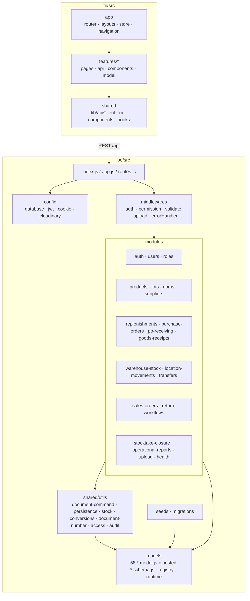
```mermaid
flowchart TB
  subgraph BE["be/src"]
    direction TB
    idx["index.js / app.js / routes.js"]
    cfg["config<br/>database · jwt · cookie · cloudinary"]
    mw["middlewares<br/>auth · permission · validate · upload · errorHandler"]
    subgraph mods["modules"]
      m1["auth · users · roles"]
      m2["products · lots · uoms · suppliers"]
      m3["replenishments · purchase-orders · po-receiving · goods-receipts"]
      m4["warehouse-stock · location-movements · transfers"]
      m5["sales-orders · return-workflows"]
      m6["stocktake-closure · operational-reports · upload · health"]
    end
    sh["shared/utils<br/>document-command · persistence · stock · conversions · document-number · access · audit"]
    mdl["models<br/>58 *.model.js + nested *.schema.js · registry · runtime"]
    sd["seeds · migrations"]
    idx --> mw --> mods
    idx --> cfg
    mods --> sh --> mdl
    mods --> mdl
    sd --> mdl
  end
  subgraph FE["fe/src"]
    direction TB
    app["app<br/>router · layouts · store · navigation"]
    feat["features/*<br/>pages · api · components · model"]
    shr["shared<br/>lib/apiClient · ui · components · hooks"]
    app --> feat --> shr
  end
  shr -. "REST /api" .-> idx
```

**Package descriptions**

| No | Package | Description and naming conventions |
|---|---|---|
| 01 | `be/src/config` | Environment-bound adapters: `database.js`, `jwt.js`, `cookie.js`, `cloudinary.js`. camelCase file names. |
| 02 | `be/src/middlewares` | Cross-cutting Express middleware. One concern per file (`auth.js`, `permission.js`, `validate.js`, `upload.js`, `errorHandler.js`). |
| 03 | `be/src/modules/<feature>` | One folder per feature in kebab-case. Files: `<feature>.routes.js` (router), `<feature>.controller.js` (HTTP adapter, older modules), `<feature>.service.js` / `.commands.js` (business logic), `<feature>.validation.js` (Zod). Commands are named verb + noun (`createPurchaseOrder`, `confirmPicking`). |
| 04 | `be/src/shared/utils` | Reusable domain helpers: command pipeline, transactions, stock posting, decimal/conversion, document identity, access/scope, audit. |
| 05 | `be/src/models` | One collection per `<name>.model.js` and one nested schema per `<name>.schema.js` (kebab-case). Model names PascalCase (`PurchaseOrder`), collections snake_case plural (`purchase_orders`). Registry in `index.js`/`registry.js`, runtime export in `runtime.js`. |
| 06 | `be/src/seeds`, `be/src/migrations` | Seed data (`seeds/data/*.data.js`, permission catalogue) and migration/rebuild scripts kept for regression. |
| 07 | `fe/src/app` | Application shell, router, navigation by permission, Redux store. |
| 08 | `fe/src/features/<feature>` | Feature folder in kebab-case with `pages/` (PascalCase `*Page.tsx`), `api/` (RTK Query endpoints injected into `baseApi`), `components/`, helpers and co-located `*.test.ts(x)`. |
| 09 | `fe/src/shared` | `lib/apiClient.ts`, `lib/authToken.ts`, shared UI components, hooks. |

### 3. Database Design

WMSD uses MongoDB with **61 registered collections** (58 business collections and 3 system administration collections added on 23/11/2026) organized into 10 functional groups. The complete entity-relationship overview and per-group diagrams are maintained in [WMSD_DB_Design_Overview.drawio](../03_thiet_ke/DB_Current_2026-11-12_58/WMSD_DB_Design_Overview.drawio).

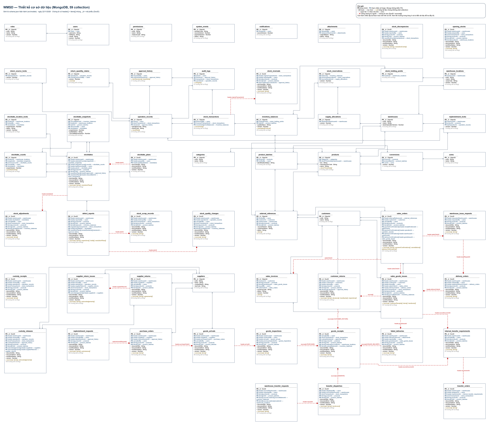

**Conventions & Scope Notes**

- **MongoDB references**: Mongoose `ref` and logical document links listed under *Foreign keys* below are application-enforced references, not database-enforced foreign key constraints.
- **Document identity**: Business document collections use `DocumentIdentity` (`_id = documentNo`, formatted as `[Type]-[Warehouse/Dept]-[YYMMDD]-[Sequence]`, allocated inside the creating transaction), while catalogue and technical collections use `ObjectId` `_id`.
- **Common business envelope**: Business documents share `documentNo`, `documentKind`, `workflowStatus`, `version` (optimistic concurrency), `createdBy`, `updatedBy`, `cancelledBy`, `evidenceIds`, `header`, `items[]` (embedded lines with stable `_id`), and `sources[]` (`subjectCollection`, `documentId`, `itemId`, `linkedQty`, `relationCode`).
- **Selected-scope compatibility**: `customers`, `warehouse_issue_requests`, `delivery_orders`, `failed_deliveries`, `sales_invoices` (model only), and `supply_allocations` (legacy read-only) are retained in the runtime schema for historical compatibility; new workflows use document-level buyer details and direct Sales Order → Goods Issue links.
- **Full field-level reference**: Complete column definitions, embedded subdocuments, and indexes are maintained in [WMSD_Data_Dictionary.md](../03_thiet_ke/DB_Current_2026-11-12_58/WMSD_Data_Dictionary.md); full relationship cardinality and verification sources are in [WMSD_Overview_Relationships.md](../03_thiet_ke/DB_Current_2026-11-12_58/WMSD_Overview_Relationships.md).

#### 3.1 Access Control & System Administration

This group manages user accounts, role-based access control (RBAC), permissions, notifications, private file attachments, outbox events, and system administration tables (`app_settings`, `api_endpoints`, `error_logs`).

> **Diagram:** Tab **Phân quyền và quản trị hệ thống** (`he-thong`) in [WMSD_DB_Design_Overview.drawio](../03_thiet_ke/DB_Current_2026-11-12_58/WMSD_DB_Design_Overview.drawio).

**Table Descriptions**

| No | Collection | Description |
|---|---|---|
| 01 | `permissions` | Stores the fixed operation-permission catalogue grouped by function. - Primary keys: `_id` (ObjectId) - Foreign keys: None |
| 02 | `roles` | Stores default and Administrator-created roles holding selected permission IDs. - Primary keys: `_id` (ObjectId) - Foreign keys: `permissionIds` (`permissions`) |
| 03 | `users` | Stores staff accounts with one assigned role, multiple assigned warehouses, bcrypt password hash, lock reason, and `lastLoginAt`. - Primary keys: `_id` (ObjectId) - Foreign keys: `roleId` (`roles`), `warehouseIds` (`warehouses`) |
| 04 | `notifications` | Stores per-recipient notifications, read status, low-stock condition tracking, and SMTP email delivery status. - Primary keys: `_id` (ObjectId) - Foreign keys: `recipientId` (`users`), `warehouseIds` (`warehouses`) |
| 05 | `app_settings` | Stores keyed system configuration records (such as `SALES_POLICY` and low-stock scan timestamps) with version tracking. - Primary keys: `_id` (ObjectId) - Foreign keys: `updatedBy` (`users`) |
| 06 | `api_endpoints` | Stores the API endpoint catalogue combining Express-synced `SYSTEM` routes and Administrator-managed `MANUAL` entries. - Primary keys: `_id` (ObjectId) - Foreign keys: `updatedBy` (`users`) |
| 07 | `attachments` | Stores metadata for private evidence files (Cloudinary storage key, hash, access category) and replacement links. - Primary keys: `_id` (ObjectId) - Foreign keys: `uploadedBy` (`users`), `replacesAttachmentId` (`attachments`) |
| 08 | `error_logs` | Stores deduplicated server (5xx), background job, and process errors grouped by fingerprint with resolution status. - Primary keys: `_id` (ObjectId) - Foreign keys: `lastUserId` (`users`), `resolvedBy` (`users`) |
| 09 | `system_events` | Stores transactional outbox events written in business commands for asynchronous post-commit notification/email handlers. - Primary keys: `_id` (ObjectId) - Foreign keys: None (logical `sourceId` per `sourceType`) |

#### 3.2 Approvals & Audit Logs

This group records versioned independent approval decisions, actor-bound idempotency operation records, and immutable system audit logs separate from stock ledger history.

> **Diagram:** Tab **Phê duyệt và nhật ký** (`phe-duyet`) in [WMSD_DB_Design_Overview.drawio](../03_thiet_ke/DB_Current_2026-11-12_58/WMSD_DB_Design_Overview.drawio).

**Table Descriptions**

| No | Collection | Description |
|---|---|---|
| 10 | `approval_history` | Stores versioned approval or rejection decisions on documents and lines by an independent approver, including authority snapshots. - Primary keys: `_id` (ObjectId) - Foreign keys: `requestedBy` (`users`), `decidedBy` (`users`), `evidenceIds` (`attachments`), `supersedesDecisionId` (`approval_history`), logical `subjectId` |
| 11 | `operation_records` | Stores actor-bound idempotency keys, request hashes, and linked result references to prevent duplicate command execution. - Primary keys: `_id` (ObjectId) - Foreign keys: `actorId` (`users`), `stockTransactionId` (`stock_transactions`), `decisionId` (`approval_history`) |
| 12 | `audit_logs` | Stores actor, action, outcome, and field-level diffs for operational and administrative changes, separate from stock quantities. - Primary keys: `_id` (ObjectId) - Foreign keys: `actorId` (`users`), `warehouseIds` (`warehouses`), `decisionId` (`approval_history`), `operationId` (`operation_records`), `transactionId` (`stock_transactions`) |

#### 3.3 Product Catalogue & Units

This group manages tile product master data, categories, manufacturer batches (lots), units of measure (UOMs), and versioned unit conversion factors.

> **Diagram:** Tab **Danh mục hàng hóa** (`danh-muc`) in [WMSD_DB_Design_Overview.drawio](../03_thiet_ke/DB_Current_2026-11-12_58/WMSD_DB_Design_Overview.drawio).

**Table Descriptions**

| No | Collection | Description |
|---|---|---|
| 13 | `categories` | Stores the 5 approved product classification groups; each product belongs to one category. - Primary keys: `_id` (ObjectId) - Foreign keys: None |
| 14 | `products` | Stores tile products (manufacturer, SKU, colour, dimensions in mm, base unit, images) and per-warehouse stock thresholds. - Primary keys: `_id` (ObjectId) - Foreign keys: `categoryId` (`categories`), `stockThresholds[].warehouseId` (`warehouses`), logical `baseUnit` (`uoms.code`) |
| 15 | `product_batches` | Stores manufacturer lots per product with fixed pieces per carton, carton dimensions, optional tone/calibre, and `VERIFIED`/`UNKNOWN` status. - Primary keys: `_id` (ObjectId) - Foreign keys: `productId` (`products`), `verifiedBy` (`users`) |
| 16 | `uoms` | Stores the unit-of-measure catalogue with immutable code, carton flag, and optional area (`areaMm2`) for automatic tile conversion. - Primary keys: `_id` (ObjectId) - Foreign keys: None |
| 17 | `conversions` | Stores versioned `Decimal128` base-unit conversion factors per product, optional batch, and UOM, valid from a specified date. - Primary keys: `_id` (ObjectId) - Foreign keys: `productId` (`products`), `productBatchId` (`product_batches`), `uomId` (`uoms`), `createdBy` (`users`) |

#### 3.4 Warehouse & Inventory Ledger

This group models physical warehouses, storage locations, holding points, inventory balances with packaging portions, stock transactions, reservations, opening balances, and stock reversals.

> **Diagram:** Tab **Kho và tồn kho** (`ton-kho`) in [WMSD_DB_Design_Overview.drawio](../03_thiet_ke/DB_Current_2026-11-12_58/WMSD_DB_Design_Overview.drawio).

**Table Descriptions**

| No | Collection | Description |
|---|---|---|
| 18 | `warehouses` | Stores physical warehouses, dimensions, active status, `stockOperationVersion`, and 2D/3D layout drafts and applied snapshots. - Primary keys: `_id` (ObjectId) - Foreign keys: None |
| 19 | `warehouse_locations` | Stores locations inside a warehouse with type (`RECEIVING`, `STORAGE`, `STAGING`, `QUARANTINE`, `CUSTODY`), usable dimensions, and pickable flag. - Primary keys: `_id` (ObjectId) - Foreign keys: `warehouseId` (`warehouses`) |
| 20 | `stock_holding_points` | Abstracts where stock resides: either a physical `LOCATION` or an `IN_TRANSIT` point tied to a transfer dispatch line. - Primary keys: `_id` (ObjectId) - Foreign keys: `locationId` (`warehouse_locations`), logical `dispatchLineId` (`transfer_dispatches`) |
| 21 | `supply_allocations` | Stores legacy PO/TR supply allocation records retained for read compatibility in transfer details. - Primary keys: `_id` (ObjectId) - Foreign keys: `destinationWarehouseId` (`warehouses`), `createdBy` (`users`), `updatedBy` (`users`) |
| 22 | `inventory_balances` | Stores exact base-unit stock balances by holding point, batch, quality status, and owner, with embedded `packagingPortions[]`. - Primary keys: `_id` (ObjectId) - Foreign keys: `holdingPointId` (`stock_holding_points`), `batchId` (`product_batches`), logical `ownerId` (`suppliers`/`customers`) |
| 23 | `opening_stocks` | Stores verified opening inventory documents per warehouse, location, lot, quality, and owner (for file imports, `openingImportSource = FILE`, at most one `POSTED` document per warehouse). - Primary keys: `_id` (DocumentIdentity / `documentNo`) - Foreign keys: `header.warehouseId` (`warehouses`), `stockTransactionId` (`stock_transactions`), `createdBy`/`updatedBy`/`postedBy`/`cancelledBy` (`users`), `evidenceIds` (`attachments`), `items[].locationId` (`warehouse_locations`) |
| 24 | `stock_reservations` | Tracks reserved inventory quantities bound to demand and execution documents, recording consumed, released, and moved quantities. - Primary keys: `_id` (ObjectId) - Foreign keys: `balanceId` (`inventory_balances`), `sourceAllocationId` (`supply_allocations`), `previousReservationId` (`stock_reservations`), `createdBy`/`updatedBy` (`users`) |
| 25 | `stock_reversals` | Stores requests and approvals to reverse an eligible erroneous stock transaction while preserving a link to the original posting. - Primary keys: `_id` (DocumentIdentity / `documentNo`) - Foreign keys: `header.originalTransactionId` (`stock_transactions`), `stockTransactionId` (`stock_transactions`), `createdBy`/`updatedBy`/`postedBy`/`cancelledBy` (`users`), `evidenceIds` (`attachments`), `header.warehouseIds` (`warehouses`) |
| 26 | `stock_transactions` | Stores immutable stock posting records containing `movements[]`, source document link, and unique idempotency `requestKey`. - Primary keys: `_id` (ObjectId) - Foreign keys: `movements[].fromBalanceId` (`inventory_balances`), `movements[].toBalanceId` (`inventory_balances`), `performedBy` (`users`), `reversedTransactionId` (`stock_transactions`) |

#### 3.5 Stocktake & Reconciliation

This group supports periodic stocktake planning, stocktake sessions, frozen book snapshots, location locks, physical counts/recounts, and approved quantity adjustments.

> **Diagram:** Tab **Kiểm kê và điều chỉnh** (`kiem-ke`) in [WMSD_DB_Design_Overview.drawio](../03_thiet_ke/DB_Current_2026-11-12_58/WMSD_DB_Design_Overview.drawio).

**Table Descriptions**

| No | Collection | Description |
|---|---|---|
| 27 | `stocktake_plans` | Stores recurring stocktake schedules (`MONTHLY`, `QUARTERLY`, `YEARLY`), scope, assigned counters, and next due period without locking stock. - Primary keys: `_id` (DocumentIdentity / `documentNo`) - Foreign keys: `header.warehouseId` (`warehouses`), `createdBy`/`updatedBy` (`users`), `header.lastStocktakeId` (`stocktakes`) |
| 28 | `stocktakes` | Stores stocktake sessions with scope, schedule, counters, `settledLines[]`, `recountLines[]`, `countReasons[]`, and closure state. - Primary keys: `_id` (DocumentIdentity / `documentNo`) - Foreign keys: `header.planId` (`stocktake_plans`), `header.warehouseId` (`warehouses`), `createdBy`/`updatedBy`/`cancelledBy` (`users`), `evidenceIds` (`attachments`) |
| 29 | `stocktake_snapshots` | Stores immutable book quantities per location, batch, owner, and quality frozen when a stocktake session is activated. - Primary keys: `_id` (ObjectId) - Foreign keys: `stocktakeId` (`stocktakes`), `sourceBalanceId` (`inventory_balances`), `locationId` (`warehouse_locations`), `batchId` (`product_batches`), `discoveredBy` (`users`), `evidenceIds` (`attachments`) |
| 30 | `stock_adjustments` | Stores approved non-zero inventory quantity adjustment documents generated during stocktake reconciliation. - Primary keys: `_id` (DocumentIdentity / `documentNo`) - Foreign keys: `header.stocktakeId` (`stocktakes`), `stockTransactionId` (`stock_transactions`), `createdBy`/`updatedBy`/`postedBy`/`cancelledBy` (`users`), `evidenceIds` (`attachments`), `header.warehouseId` (`warehouses`) |
| 31 | `stocktake_location_locks` | Stores location freeze history during stocktakes, enforcing at most one active lock per warehouse location. - Primary keys: `_id` (ObjectId) - Foreign keys: `stocktakeId` (`stocktakes`), `locationId` (`warehouse_locations`), `lockedBy`/`releasedBy` (`users`) |
| 32 | `stocktake_counts` | Stores physical count, recount, and append-only empty-count correction records with unit, conversion, and evidence. - Primary keys: `_id` (ObjectId) - Foreign keys: `stocktakeId` (`stocktakes`), `snapshotId` (`stocktake_snapshots`), `locationId` (`warehouse_locations`), `previousCountId`/`correctsEmptyCountId` (`stocktake_counts`), `countedBy` (`users`), `evidenceIds` (`attachments`) |

#### 3.6 Defect Handling & Quality Disposition

This group handles suspected defect reporting, quality quarantine/reclassification, and approved destruction (scrapping) of defective stock.

> **Diagram:** Tab **Xử lý hàng lỗi** (`hang-loi`) in [WMSD_DB_Design_Overview.drawio](../03_thiet_ke/DB_Current_2026-11-12_58/WMSD_DB_Design_Overview.drawio).

**Table Descriptions**

| No | Collection | Description |
|---|---|---|
| 33 | `stock_scrap_records` | Stores actual destruction documents for approved defective stock, deducting only the verified scrapped quantity. - Primary keys: `_id` (DocumentIdentity / `documentNo`) - Foreign keys: logical `header.planId` (`defect_reports.resolutionPlans[]`), `stockTransactionId` (`stock_transactions`), `createdBy`/`updatedBy`/`postedBy`/`cancelledBy` (`users`), `evidenceIds` (`attachments`), `header.warehouseId` (`warehouses`) |
| 34 | `defect_reports` | Stores defect cases including detection source, quarantine holds, inspections, resolution plans, and disposition history. - Primary keys: `_id` (DocumentIdentity / `documentNo`) - Foreign keys: `header.warehouseId` (`warehouses`), `createdBy`/`updatedBy`/`cancelledBy` (`users`), `evidenceIds` (`attachments`) |
| 35 | `stock_quality_changes` | Stores quality reclassification documents (e.g., `GOOD` ↔ `DAMAGED`/`BLOCKED`) without changing total quantity; stock can move to a location allowed for the target quality (`QUARANTINE` or `CUSTODY` for non-`GOOD` stock). - Primary keys: `_id` (DocumentIdentity / `documentNo`) - Foreign keys: logical `header.planId` (`defect_reports.resolutionPlans[]`), `stockTransactionId` (`stock_transactions`), `createdBy`/`updatedBy`/`postedBy`/`cancelledBy` (`users`), `evidenceIds` (`attachments`), `header.warehouseId` (`warehouses`) |

#### 3.7 Purchasing & Goods Receiving

This group covers replenishment requests, supplier master data, purchase orders, physical goods arrivals, receiving inspections, unified goods receipts (5 discriminator kinds), and custody handling.

> **Diagram:** Tab **Mua hàng và nhập kho** (`mua-hang`) in [WMSD_DB_Design_Overview.drawio](../03_thiet_ke/DB_Current_2026-11-12_58/WMSD_DB_Design_Overview.drawio).

**Table Descriptions**

| No | Collection | Description |
|---|---|---|
| 36 | `replenishment_requests` | Stores warehouse replenishment requests with requested/approved base quantities and immutable submission warning snapshots. - Primary keys: `_id` (DocumentIdentity / `documentNo`) - Foreign keys: `header.latestDecisionId` (`approval_history`), `header.warehouseId` (`warehouses`), `createdBy`/`updatedBy`/`cancelledBy` (`users`), `evidenceIds` (`attachments`) |
| 37 | `purchase_orders` | Stores purchase orders for one warehouse and one supplier (at most one active PO per linked RR) with purchase prices and expected date. - Primary keys: `_id` (DocumentIdentity / `documentNo`) - Foreign keys: `header.supplierId` (`suppliers`), logical `replenishmentRequestId` (`replenishment_requests`), `createdBy`/`updatedBy`/`cancelledBy` (`users`), `evidenceIds` (`attachments`), `header.warehouseId` (`warehouses`), `header.closureDecisionId` (`approval_history`) |
| 38 | `goods_arrivals` | Stores each physical supplier delivery against a PO, preserved for audit even when all delivered items are rejected. - Primary keys: `_id` (DocumentIdentity / `documentNo`) - Foreign keys: `header.purchaseOrderId` (`purchase_orders`), `createdBy`/`updatedBy`/`cancelledBy` (`users`), `evidenceIds` (`attachments`), `header.warehouseId` (`warehouses`), `header.supplierId` (`suppliers`) |
| 39 | `goods_inspections` | Stores receiving inspection results per arrival: batch, quality, packaging (`SEALED`/`OPEN`/`LOOSE`), and `ACCEPT`/`CUSTODY`/`REJECT` decisions. - Primary keys: `_id` (DocumentIdentity / `documentNo`) - Foreign keys: `header.arrivalId` (`goods_arrivals`), `createdBy`/`updatedBy`/`cancelledBy` (`users`), `evidenceIds` (`attachments`), `header.warehouseId` (`warehouses`) |
| 40 | `suppliers` | Stores supplier master records including contact details, tax code, and lifecycle status (`ACTIVE`, `SUSPENDED`, `TERMINATED`). - Primary keys: `_id` (ObjectId) - Foreign keys: None |
| 41 | `goods_receipts` | Unified goods receipt collection using 5 discriminators (`PURCHASE`, `CUSTOMER_RETURN`, `FAILED_DELIVERY`, `TRANSFER`, `OTHER`) to post inbound stock. - Primary keys: `_id` (DocumentIdentity / `documentNo`) - Foreign keys: `{PURCHASE}.header.purchaseOrderId` (`purchase_orders`), `{CUSTOMER_RETURN}.header.returnId` (`customer_returns`), logical `{PURCHASE}.sources[].documentId` (`goods_inspections`), logical `{TRANSFER}.header.dispatchId` (`transfer_dispatches`), `stockTransactionId` (`stock_transactions`), `custodyDecisionId`/`approvalDecisionId` (`approval_history`), `createdBy`/`updatedBy`/`postedBy`/`cancelledBy` (`users`), `evidenceIds` (`attachments`), `header.warehouseId` (`warehouses`), `{PURCHASE}.header.supplierId` (`suppliers`), `{PURCHASE}.header.arrivalId` (`goods_arrivals`), `{FAILED_DELIVERY}.header.failedDeliveryId` (`failed_deliveries`), `{FAILED_DELIVERY}.header.goodsIssueId` (`sales_goods_issues`), `items[].destinationLocationId` (`warehouse_locations`) |
| 42 | `custody_receipts` | Stores physical intake of supplier-owned (and historical customer-owned) custody stock occupying warehouse space without store ownership. - Primary keys: `_id` (DocumentIdentity / `documentNo`) - Foreign keys: logical `sources[].documentId` (`goods_inspections`), `stockTransactionId` (`stock_transactions`), `createdBy`/`updatedBy`/`postedBy`/`cancelledBy` (`users`), `evidenceIds` (`attachments`), `header.warehouseId` (`warehouses`) |
| 43 | `custody_releases` | Stores hand-back documents for custody goods, optionally embedding supplier acknowledgements. - Primary keys: `_id` (DocumentIdentity / `documentNo`) - Foreign keys: `acknowledgements[].header.supplierReturnId` (`supplier_returns`), `stockTransactionId` (`stock_transactions`), `custodyDecisionId` (`approval_history`), `createdBy`/`updatedBy`/`postedBy`/`cancelledBy` (`users`), `evidenceIds` (`attachments`), `header.warehouseId` (`warehouses`) |

#### 3.8 Sales & Direct Goods Issue

This group manages sales orders and direct sales goods issues, along with historical compatibility collections retained for legacy delivery/customer flows.

> **Diagram:** Tab **Bán hàng và xuất kho** (`ban-hang`) in [WMSD_DB_Design_Overview.drawio](../03_thiet_ke/DB_Current_2026-11-12_58/WMSD_DB_Design_Overview.drawio).

**Table Descriptions**

| No | Collection | Description |
|---|---|---|
| 44 | `warehouse_issue_requests` | *(Historical compatibility)* Legacy issue requests split by Sales from a sales order; excluded from new direct-issue workflows. - Primary keys: `_id` (DocumentIdentity / `documentNo`) - Foreign keys: logical `header.salesOrderId` (`sales_orders`), `createdBy`/`updatedBy`/`cancelledBy` (`users`), `evidenceIds` (`attachments`), `header.requestedWarehouseId` (`warehouses`) |
| 45 | `sales_orders` | Stores sales orders with document-level buyer details (`customerName`, `customerPhone`, delivery address), line prices, and source references. - Primary keys: `_id` (DocumentIdentity / `documentNo`) - Foreign keys: `header.customerId` (`customers`, optional compatibility), `createdBy`/`updatedBy`/`cancelledBy` (`users`), `evidenceIds` (`attachments`), `header.externalReferenceId` (`external_references`) |
| 46 | `customers` | *(Historical compatibility)* Legacy customer catalogue records; excluded from new functional requirements and retained read-only for old references. - Primary keys: `_id` (ObjectId) - Foreign keys: None |
| 47 | `delivery_orders` | *(Historical compatibility)* Legacy delivery orders scheduled from a WIR; excluded from new direct-issue workflows. - Primary keys: `_id` (DocumentIdentity / `documentNo`) - Foreign keys: logical `header.issueRequestId` (`warehouse_issue_requests`), `createdBy`/`updatedBy`/`cancelledBy` (`users`), `evidenceIds` (`attachments`), `header.warehouseId` (`warehouses`) |
| 48 | `sales_goods_issues` | Stores direct sales and other goods issues (`GI_SALE`/`GI_OTHER`) from `DRAFT` to `POSTED` (Sales-created issues wait in `PENDING_APPROVAL` first; issues with picking tasks pass through `PICKED`), including embedded customer receipt evidence. - Primary keys: `_id` (DocumentIdentity / `documentNo`) - Foreign keys: `header.salesOrderId` (`sales_orders`), `header.deliveryOrderId` (`delivery_orders`, compatibility), `stockTransactionId` (`stock_transactions`), `createdBy`/`updatedBy`/`approvedBy`/`postedBy`/`cancelledBy` (`users`), `evidenceIds` (`attachments`), `header.warehouseId` (`warehouses`), `header.customerId` (`customers`, optional compatibility), `items[].sourceBalanceId` (`inventory_balances`) |
| 49 | `sales_invoices` | Stores consolidated sales invoice records per sales order (schema registered; no active API workflow in current scope). - Primary keys: `_id` (ObjectId) - Foreign keys: `salesOrderId` (`sales_orders`), `items[].goodsIssueId` (`sales_goods_issues`), `customerId` (`customers`), `createdBy`/`issuedBy` (`users`) |
| 50 | `failed_deliveries` | *(Historical compatibility)* Legacy standalone failed-delivery records; excluded from new direct-issue workflows where unreceived goods return inline. - Primary keys: `_id` (DocumentIdentity / `documentNo`) - Foreign keys: `createdBy`/`updatedBy`/`cancelledBy` (`users`), `evidenceIds` (`attachments`), `header.warehouseId` (`warehouses`), `header.goodsIssueId` (`sales_goods_issues`) |

#### 3.9 Customer & Supplier Returns

This group manages verified historical external return sources, concurrency locks and return-quantity claims, customer return requests, supplier return proposals, and supplier return dispatches.

> **Diagram:** Tab **Trả hàng** (`tra-hang`) in [WMSD_DB_Design_Overview.drawio](../03_thiet_ke/DB_Current_2026-11-12_58/WMSD_DB_Design_Overview.drawio).

**Table Descriptions**

| No | Collection | Description |
|---|---|---|
| 51 | `external_references` | Stores Accountant-verified external historical source documents (delivery/invoice references) with evidence for historical customer returns. - Primary keys: `_id` (ObjectId) - Foreign keys: `verifiedBy` (`users`), `warehouseId` (`warehouses`), `customerId` (`customers`, optional compatibility), `evidenceIds` (`attachments`) |
| 52 | `return_source_locks` | Provides concurrency locking per return source line across direct sales issues, external references, and supplier return sources. - Primary keys: `_id` (ObjectId) - Foreign keys: logical `sourceDocumentId` (`sales_goods_issues`, `sales_orders`, `external_references`, `goods_receipts`, `custody_receipts`), `lastOperationId` (`operation_records`) |
| 53 | `customer_returns` | Stores customer return requests against evidenced received issue lines or verified external history, with fact-only inspection and per-line decisions. - Primary keys: `_id` (DocumentIdentity / `documentNo`) - Foreign keys: logical `items[].sources[].documentId` (`sales_goods_issues`, `external_references`), `createdBy`/`updatedBy`/`cancelledBy` (`users`), `evidenceIds` (`attachments`), `header.warehouseId` (`warehouses`), `header.customerId` (`customers`, optional compatibility), `decisions[].decisionId` (`approval_history`) |
| 54 | `return_quantity_claims` | Tracks claimed, released, reacquired, and received return quantities per source line to prevent over-returning. - Primary keys: `_id` (ObjectId) - Foreign keys: logical `requestLineId` (`customer_returns`, `failed_deliveries`), logical `sourceLineId` (`sales_goods_issues`, `external_references`), `createdBy` (`users`), `operationId` (`operation_records`) |
| 55 | `supplier_returns` | Stores supplier return proposals and Accountant-verified supplier agreement details per line. - Primary keys: `_id` (DocumentIdentity / `documentNo`) - Foreign keys: `header.supplierId` (`suppliers`), `createdBy`/`updatedBy`/`cancelledBy` (`users`), `evidenceIds` (`attachments`), `header.warehouseId` (`warehouses`) |
| 56 | `supplier_return_issues` | Stores actual outbound dispatch documents returning store-owned stock back to the supplier against an agreed supplier return. - Primary keys: `_id` (DocumentIdentity / `documentNo`) - Foreign keys: `header.supplierReturnId` (`supplier_returns`), `stockTransactionId` (`stock_transactions`), `createdBy`/`updatedBy`/`postedBy`/`cancelledBy` (`users`), `evidenceIds` (`attachments`), `header.warehouseId` (`warehouses`) |

#### 3.10 Inter-Warehouse Transfers

This group manages inter-warehouse transfer requests (BF-04), staged transfer dispatches into in-transit stock, transit discrepancy records, internal transfer requirements, and warehouse transfer orders (BF-03/BF-04).

> **Diagram:** Tab **Điều chuyển kho** (`dieu-chuyen`) in [WMSD_DB_Design_Overview.drawio](../03_thiet_ke/DB_Current_2026-11-12_58/WMSD_DB_Design_Overview.drawio).

**Table Descriptions**

| No | Collection | Description |
|---|---|---|
| 57 | `warehouse_transfer_requests` | Stores inter-warehouse transfer requests with requested/approved quantities, lots, and optional source location allocations. - Primary keys: `_id` (DocumentIdentity / `documentNo`) - Foreign keys: `header.sourceWarehouseId`/`header.destinationWarehouseId` (`warehouses`), `createdBy`/`updatedBy`/`cancelledBy` (`users`), `evidenceIds` (`attachments`) |
| 58 | `transfer_dispatches` | Stores staged transfer dispatch documents against a TR with embedded handover details, posting stock from source warehouse to `IN_TRANSIT`. - Primary keys: `_id` (DocumentIdentity / `documentNo`) - Foreign keys: logical `header.requestId` (`warehouse_transfer_requests`), `stockTransactionId` (`stock_transactions`), `createdBy`/`updatedBy`/`postedBy`/`cancelledBy` (`users`), `evidenceIds` (`attachments`), `header.sourceWarehouseId`/`header.destinationWarehouseId` (`warehouses`) |
| 59 | `stock_discrepancies` | Stores shortage records for goods still in transit between warehouses, with the approved resolution (`RECEIVED` against a later receipt, or `WRITE_OFF` with a liable party) and resolution events. - Primary keys: `_id` (DocumentIdentity / `documentNo`) - Foreign keys: logical `header.sourceRef.documentId` (`transfer_dispatches`), `createdBy`/`updatedBy`/`cancelledBy` (`users`), `evidenceIds` (`attachments`), `header.warehouseId` (`warehouses`) |
| 60 | `internal_transfer_requirements` | Stores auto-generated `PICK` (from dispatch) or `PUTAWAY` (from `TRANSFER` receipt) requirements, each linked to at most one Transfer Order. - Primary keys: `_id` (DocumentIdentity / `documentNo`) - Foreign keys: logical `header.sourceDocumentId` (`transfer_dispatches`, `goods_receipts`), `createdBy`/`updatedBy`/`cancelledBy` (`users`), `evidenceIds` (`attachments`), `header.warehouseId` (`warehouses`) |
| 61 | `transfer_orders` | Stores internal warehouse movement tasks (`RELOCATE` in BF-03, `PICK` and `PUTAWAY` in BF-04, and `PICK` for goods issues) confirmed against the stock ledger. - Primary keys: `_id` (DocumentIdentity / `documentNo`) - Foreign keys: `header.requirementId` (`internal_transfer_requirements`), `stockTransactionId` (`stock_transactions`), `createdBy`/`updatedBy`/`postedBy`/`cancelledBy` (`users`), `evidenceIds` (`attachments`), `header.warehouseId` (`warehouses`), logical `sources[].documentId` (`sales_goods_issues`, goods-issue picking) |

---

## II. Detailed Code Design

Implementation status legend used in this section: **Implemented** = native API route exists and is covered by local integration tests; **Design target** = required by Report 3 but no API route yet.

### 0. Shared command pipeline (Report 3 I.2.9, EX-01–EX-05)

Every write command in sections 1–8 follows this pipeline; later diagrams show only the business steps.

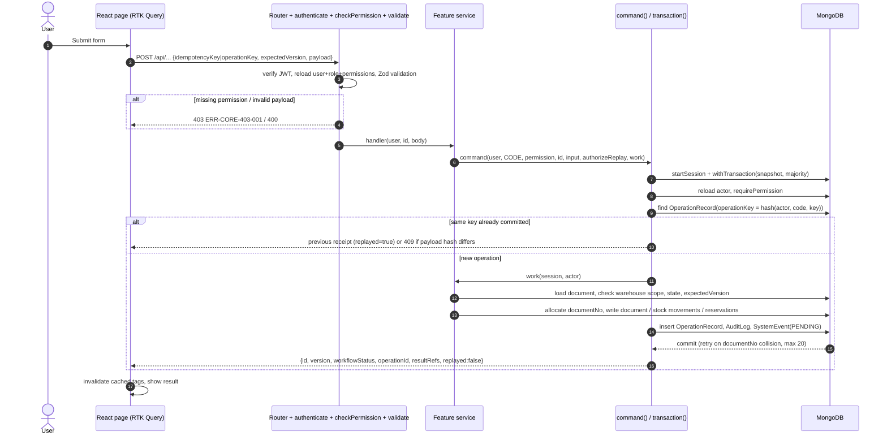
```mermaid
sequenceDiagram
  autonumber
  actor U as User
  participant FE as React page (RTK Query)
  participant R as Router + authenticate + checkPermission + validate
  participant S as Feature service
  participant C as command() / transaction()
  participant DB as MongoDB
  U->>FE: Submit form
  FE->>R: POST /api/... {idempotencyKey|operationKey, expectedVersion, payload}
  R->>R: verify JWT, reload user+role+permissions, Zod validation
  alt missing permission / invalid payload
    R-->>FE: 403 ERR-CORE-403-001 / 400
  end
  R->>S: handler(user, id, body)
  S->>C: command(user, CODE, permission, id, input, authorizeReplay, work)
  C->>DB: startSession + withTransaction(snapshot, majority)
  C->>DB: reload actor, requirePermission
  C->>DB: find OperationRecord(operationKey = hash(actor, code, key))
  alt same key already committed
    C-->>FE: previous receipt (replayed=true) or 409 if payload hash differs
  else new operation
    C->>S: work(session, actor)
    S->>DB: load document, check warehouse scope, state, expectedVersion
    S->>DB: allocate documentNo, write document / stock movements / reservations
    C->>DB: insert OperationRecord, AuditLog, SystemEvent(PENDING)
    DB-->>C: commit (retry on documentNo collision, max 20)
    C-->>FE: {id, version, workflowStatus, operationId, resultRefs, replayed:false}
  end
  FE->>FE: invalidate cached tags, show result
```

### 1. BF-01 Replenishment, purchasing and goods receipt — Implemented

The BF-01 diagrams follow the operations available in the application at the design/specification level. An approved Replenishment Request (RR) can produce a Purchase Order (PO). Staff create a Goods Inspection (INS) with its Goods Arrival (ARR) against an open PO. Confirmation can produce a draft purchase Goods Receipt (GR), a draft supplier Custody Receipt, or both, depending on the inspection lines. Every write command also runs the shared pipeline in section 0. Editable sequence diagrams are available in [WMSD BF-01 diagrams](../04_so_do/WMSD_BF01_Diagrams.drawio). In the class diagrams, dotted arrows (`..>`) denote call or read/write dependencies, dashed triangles (`..|>`) denote interface realization, and solid arrows (`-->`) with multiplicity denote stored references. Document ids such as `RR-warehouse-YYMMDD-seq` are placeholders: the stored `_id` uses the Vietnamese type code (`YCBS` for RR, `ĐMH` for PO, `HĐK` for ARR, `PKN` for INS, `PNM` for GR, `PNGH` for CustodyReceipt, `PXGH` for CustodyRelease, `PĐN` for StockReversal), the warehouse code, the date and a six-digit sequence.

#### 1.1 Replenishment Request (RR)

##### 1.1.1 Class Diagram

Express routes in `replenishment.routes.js` handle JWT authentication and Zod validation before dispatching to `ReplenishmentController`; route-level or command-level RBAC guards are enforced per operation.

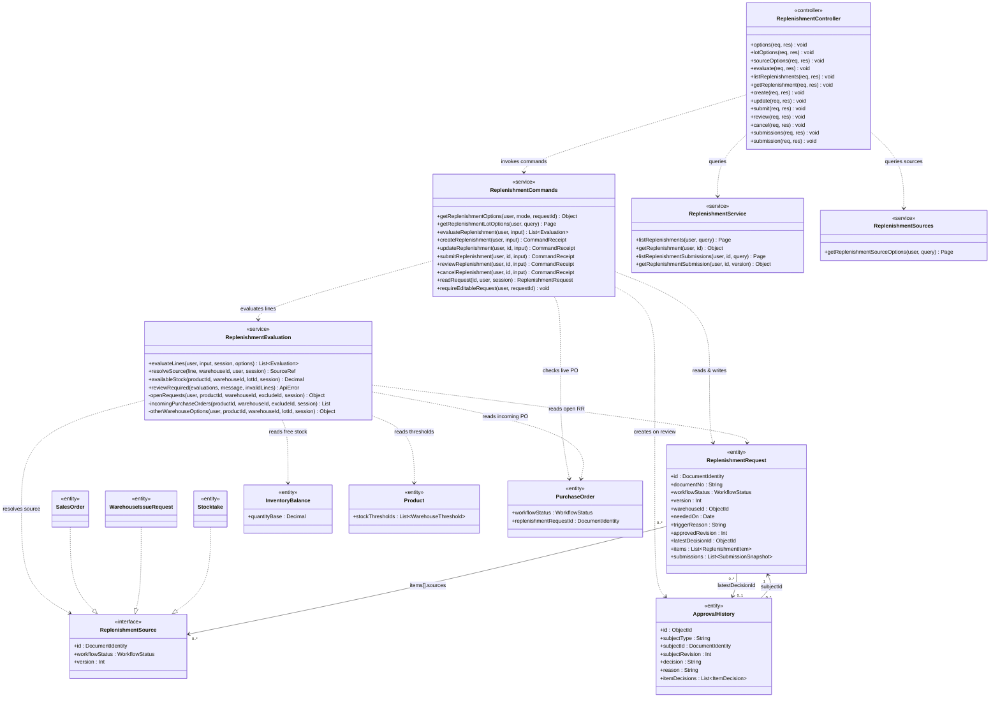
```mermaid
classDiagram
  class ReplenishmentController {
    <<controller>>
    +options(req, res) void
    +lotOptions(req, res) void
    +sourceOptions(req, res) void
    +evaluate(req, res) void
    +listReplenishments(req, res) void
    +getReplenishment(req, res) void
    +create(req, res) void
    +update(req, res) void
    +submit(req, res) void
    +review(req, res) void
    +cancel(req, res) void
    +submissions(req, res) void
    +submission(req, res) void
  }
  class ReplenishmentCommands {
    <<service>>
    +getReplenishmentOptions(user, mode, requestId) Object
    +getReplenishmentLotOptions(user, query) Page
    +evaluateReplenishment(user, input) List~Evaluation~
    +createReplenishment(user, input) CommandReceipt
    +updateReplenishment(user, id, input) CommandReceipt
    +submitReplenishment(user, id, input) CommandReceipt
    +reviewReplenishment(user, id, input) CommandReceipt
    +cancelReplenishment(user, id, input) CommandReceipt
    +readRequest(id, user, session) ReplenishmentRequest
    +requireEditableRequest(user, requestId) void
  }
  class ReplenishmentEvaluation {
    <<service>>
    +evaluateLines(user, input, session, options) List~Evaluation~
    +resolveSource(line, warehouseId, user, session) SourceRef
    +availableStock(productId, warehouseId, lotId, session) Decimal
    +reviewRequired(evaluations, message, invalidLines) ApiError
    -openRequests(user, productId, warehouseId, excludeId, session) Object
    -incomingPurchaseOrders(productId, warehouseId, excludeId, session) List
    -otherWarehouseOptions(user, productId, warehouseId, lotId, session) Object
  }
  class ReplenishmentService {
    <<service>>
    +listReplenishments(user, query) Page
    +getReplenishment(user, id) Object
    +listReplenishmentSubmissions(user, id, query) Page
    +getReplenishmentSubmission(user, id, version) Object
  }
  class ReplenishmentSources {
    <<service>>
    +getReplenishmentSourceOptions(user, query) Page
  }
  class ReplenishmentRequest {
    <<entity>>
    +id : DocumentIdentity
    +documentNo : String
    +workflowStatus : WorkflowStatus
    +version : Int
    +warehouseId : ObjectId
    +neededOn : Date
    +triggerReason : String
    +approvedRevision : Int
    +latestDecisionId : ObjectId
    +items : List~ReplenishmentItem~
    +submissions : List~SubmissionSnapshot~
  }
  class ApprovalHistory {
    <<entity>>
    +id : ObjectId
    +subjectType : String
    +subjectId : DocumentIdentity
    +subjectRevision : Int
    +decision : String
    +reason : String
    +itemDecisions : List~ItemDecision~
  }
  class ReplenishmentSource {
    <<interface>>
    +id : DocumentIdentity
    +workflowStatus : WorkflowStatus
    +version : Int
  }
  class SalesOrder {
    <<entity>>
  }
  class WarehouseIssueRequest {
    <<entity>>
  }
  class Stocktake {
    <<entity>>
  }
  class InventoryBalance {
    <<entity>>
    +quantityBase : Decimal
  }
  class Product {
    <<entity>>
    +stockThresholds : List~WarehouseThreshold~
  }
  class PurchaseOrder {
    <<entity>>
    +workflowStatus : WorkflowStatus
    +replenishmentRequestId : DocumentIdentity
  }
  ReplenishmentController ..> ReplenishmentCommands : invokes commands
  ReplenishmentController ..> ReplenishmentService : queries
  ReplenishmentController ..> ReplenishmentSources : queries sources
  ReplenishmentCommands ..> ReplenishmentEvaluation : evaluates lines
  ReplenishmentCommands ..> ReplenishmentRequest : reads & writes
  ReplenishmentCommands ..> ApprovalHistory : creates on review
  ReplenishmentCommands ..> PurchaseOrder : checks live PO
  ReplenishmentEvaluation ..> ReplenishmentSource : resolves source
  ReplenishmentEvaluation ..> ReplenishmentRequest : reads open RR
  ReplenishmentEvaluation ..> InventoryBalance : reads free stock
  ReplenishmentEvaluation ..> Product : reads thresholds
  ReplenishmentEvaluation ..> PurchaseOrder : reads incoming PO
  SalesOrder ..|> ReplenishmentSource
  WarehouseIssueRequest ..|> ReplenishmentSource
  Stocktake ..|> ReplenishmentSource
  ApprovalHistory "0..*" --> "1" ReplenishmentRequest : subjectId
  ReplenishmentRequest "0..*" --> "0..1" ApprovalHistory : latestDecisionId
  ReplenishmentRequest "0..*" --> "0..*" ReplenishmentSource : items[].sources
```

##### 1.1.2 Sequence diagrams

The requester is Sales Staff or Warehouse Staff.

###### 1.1.2.1 Create Replenishment Request (UC-03)

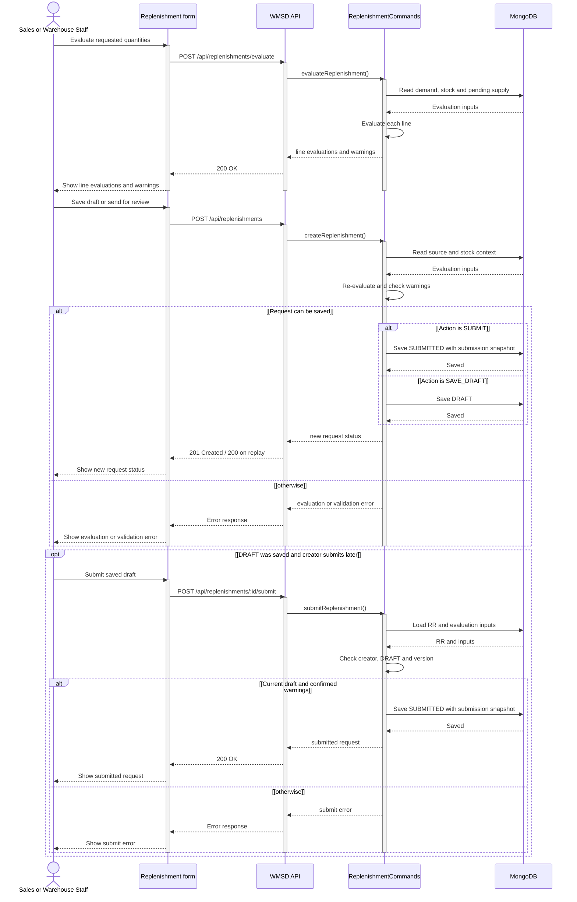
```mermaid
sequenceDiagram
  actor X as Sales or Warehouse Staff
  participant U as Replenishment form
  participant A as WMSD API
  participant S as ReplenishmentCommands
  participant D as MongoDB
  X->>U: Evaluate requested quantities
  activate U
  U->>A: POST /api/replenishments/evaluate
  activate A
  A->>S: evaluateReplenishment()
  activate S
  S->>D: Read demand, stock and pending supply
  D-->>S: Evaluation inputs
  S->>S: Evaluate each line
  S-->>A: line evaluations and warnings
  A-->>U: 200 OK
  U-->>X: Show line evaluations and warnings
  deactivate S
  deactivate A
  deactivate U
  X->>U: Save draft or send for review
  activate U
  U->>A: POST /api/replenishments
  activate A
  A->>S: createReplenishment()
  activate S
  S->>D: Read source and stock context
  D-->>S: Evaluation inputs
  S->>S: Re-evaluate and check warnings
  alt [Request can be saved]
    alt [Action is SUBMIT]
      S->>D: Save SUBMITTED with submission snapshot
      D-->>S: Saved
    else [Action is SAVE_DRAFT]
      S->>D: Save DRAFT
      D-->>S: Saved
    end
    S-->>A: new request status
    A-->>U: 201 Created / 200 on replay
    U-->>X: Show new request status
  else [otherwise]
    S-->>A: evaluation or validation error
    A-->>U: Error response
    U-->>X: Show evaluation or validation error
  end
  deactivate S
  deactivate A
  deactivate U
  opt [DRAFT was saved and creator submits later]
    X->>U: Submit saved draft
    activate U
    U->>A: POST /api/replenishments/:id/submit
    activate A
    A->>S: submitReplenishment()
    activate S
    S->>D: Load RR and evaluation inputs
    D-->>S: RR and inputs
    S->>S: Check creator, DRAFT and version
    alt [Current draft and confirmed warnings]
      S->>D: Save SUBMITTED with submission snapshot
      D-->>S: Saved
      S-->>A: submitted request
      A-->>U: 200 OK
      U-->>X: Show submitted request
    else [otherwise]
      S-->>A: submit error
      A-->>U: Error response
      U-->>X: Show submit error
    end
    deactivate S
    deactivate A
    deactivate U
  end
```

###### 1.1.2.2 Update Replenishment Request (UC-04)

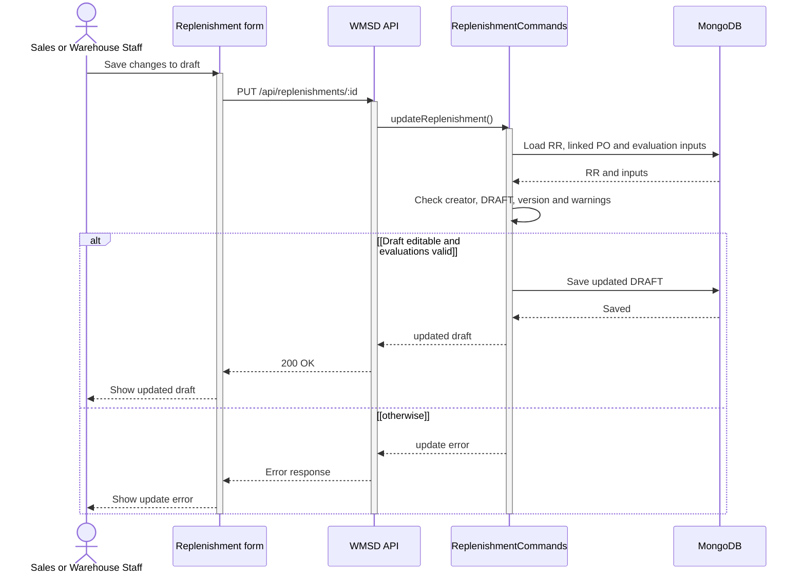
```mermaid
sequenceDiagram
  actor X as Sales or Warehouse Staff
  participant U as Replenishment form
  participant A as WMSD API
  participant S as ReplenishmentCommands
  participant D as MongoDB
  X->>U: Save changes to draft
  activate U
  U->>A: PUT /api/replenishments/:id
  activate A
  A->>S: updateReplenishment()
  activate S
  S->>D: Load RR, linked PO and evaluation inputs
  D-->>S: RR and inputs
  S->>S: Check creator, DRAFT, version and warnings
  alt [Draft editable and evaluations valid]
    S->>D: Save updated DRAFT
    D-->>S: Saved
    S-->>A: updated draft
    A-->>U: 200 OK
    U-->>X: Show updated draft
  else [otherwise]
    S-->>A: update error
    A-->>U: Error response
    U-->>X: Show update error
  end
  deactivate S
  deactivate A
  deactivate U
```

###### 1.1.2.3 Review Replenishment Request (UC-05)

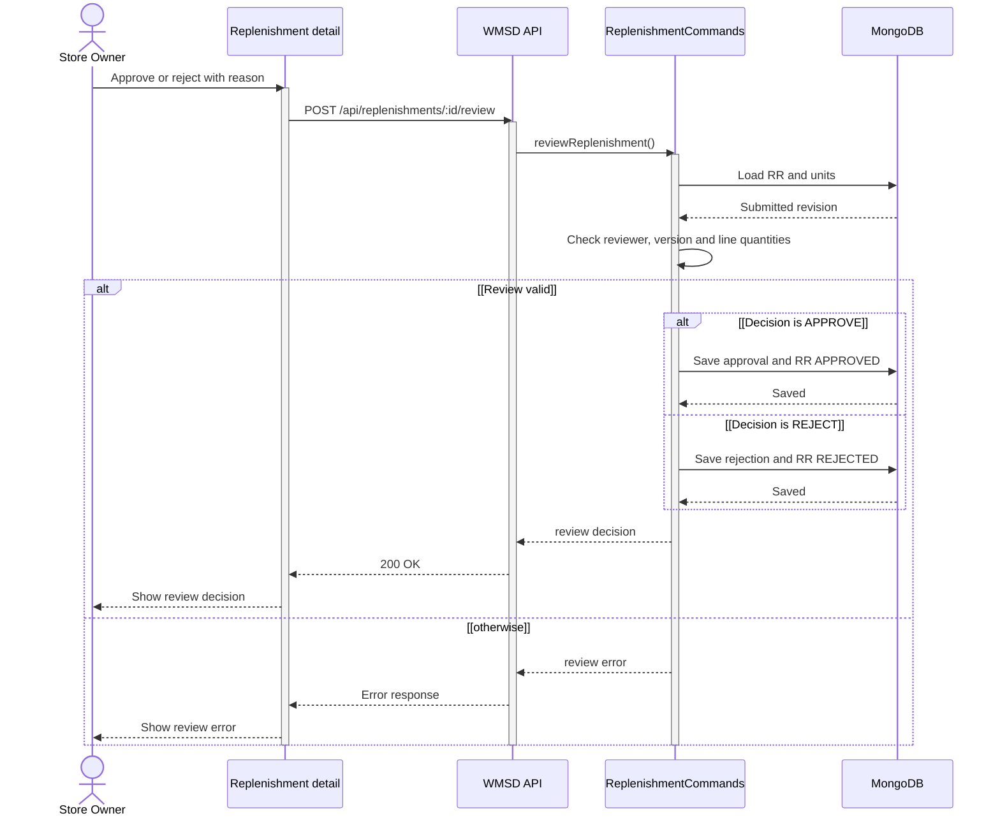
```mermaid
sequenceDiagram
  actor X as Store Owner
  participant U as Replenishment detail
  participant A as WMSD API
  participant S as ReplenishmentCommands
  participant D as MongoDB
  X->>U: Approve or reject with reason
  activate U
  U->>A: POST /api/replenishments/:id/review
  activate A
  A->>S: reviewReplenishment()
  activate S
  S->>D: Load RR and units
  D-->>S: Submitted revision
  S->>S: Check reviewer, version and line quantities
  alt [Review valid]
    alt [Decision is APPROVE]
      S->>D: Save approval and RR APPROVED
      D-->>S: Saved
    else [Decision is REJECT]
      S->>D: Save rejection and RR REJECTED
      D-->>S: Saved
    end
    S-->>A: review decision
    A-->>U: 200 OK
    U-->>X: Show review decision
  else [otherwise]
    S-->>A: review error
    A-->>U: Error response
    U-->>X: Show review error
  end
  deactivate S
  deactivate A
  deactivate U
```

###### 1.1.2.4 Cancel Replenishment Request (UC-06)

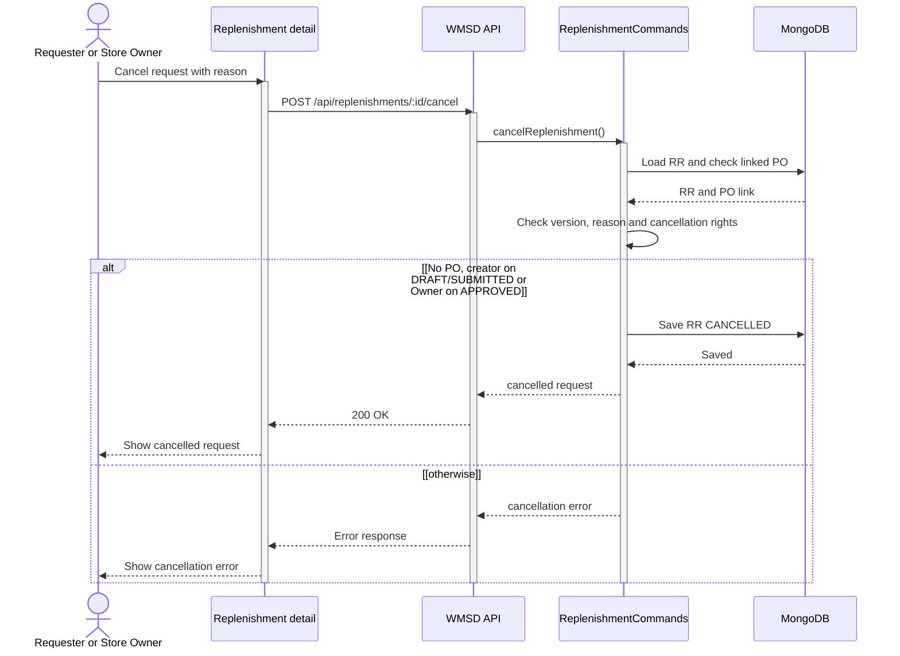
```mermaid
sequenceDiagram
  actor X as Requester or Store Owner
  participant U as Replenishment detail
  participant A as WMSD API
  participant S as ReplenishmentCommands
  participant D as MongoDB
  X->>U: Cancel request with reason
  activate U
  U->>A: POST /api/replenishments/:id/cancel
  activate A
  A->>S: cancelReplenishment()
  activate S
  S->>D: Load RR and check linked PO
  D-->>S: RR and PO link
  S->>S: Check version, reason and cancellation rights
  alt [No PO, creator on DRAFT/SUBMITTED or Owner on APPROVED]
    S->>D: Save RR CANCELLED
    D-->>S: Saved
    S-->>A: cancelled request
    A-->>U: 200 OK
    U-->>X: Show cancelled request
  else [otherwise]
    S-->>A: cancellation error
    A-->>U: Error response
    U-->>X: Show cancellation error
  end
  deactivate S
  deactivate A
  deactivate U
```

#### 1.2 Purchase Order (PO)

##### 1.2.1 Class Diagram

Read endpoints in `purchase-order.routes.js` dispatch to `PurchaseOrderController` (`checkPermission` at route level), while write endpoints in `purchase-order.commands.routes.js` dispatch directly to `PurchaseOrderCommands` where permissions are checked inside `command()`.

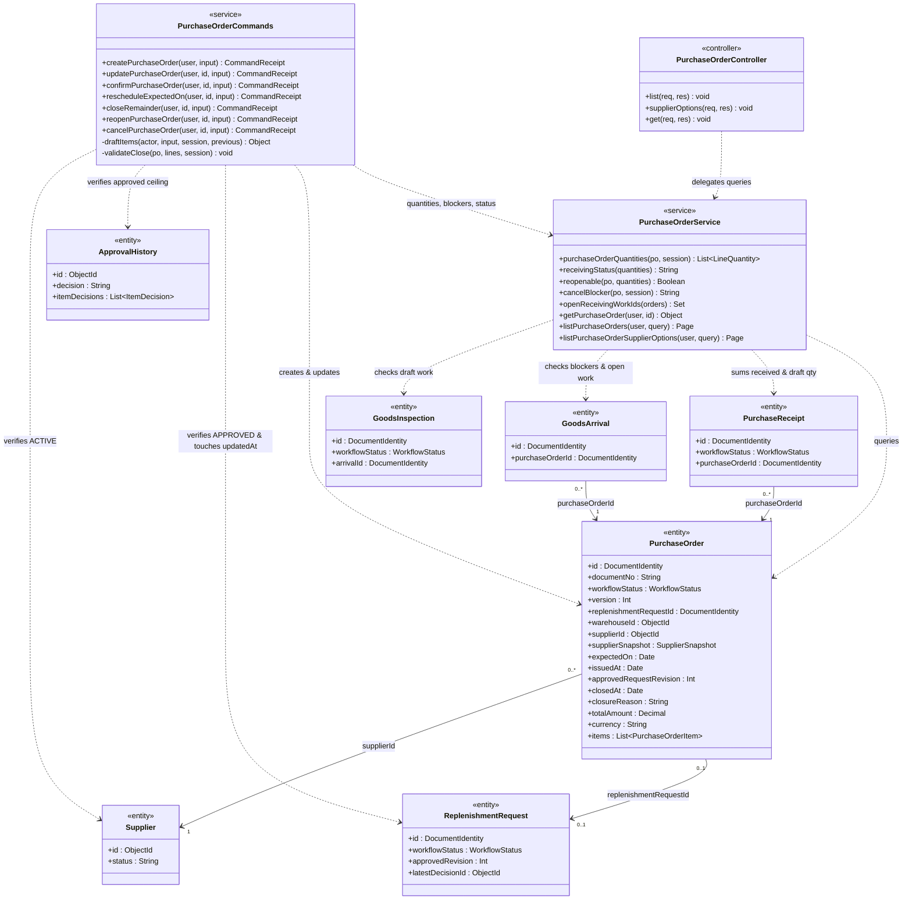
```mermaid
classDiagram
  class PurchaseOrderController {
    <<controller>>
    +list(req, res) void
    +supplierOptions(req, res) void
    +get(req, res) void
  }
  class PurchaseOrderCommands {
    <<service>>
    +createPurchaseOrder(user, input) CommandReceipt
    +updatePurchaseOrder(user, id, input) CommandReceipt
    +confirmPurchaseOrder(user, id, input) CommandReceipt
    +rescheduleExpectedOn(user, id, input) CommandReceipt
    +closeRemainder(user, id, input) CommandReceipt
    +reopenPurchaseOrder(user, id, input) CommandReceipt
    +cancelPurchaseOrder(user, id, input) CommandReceipt
    -draftItems(actor, input, session, previous) Object
    -validateClose(po, lines, session) void
  }
  class PurchaseOrderService {
    <<service>>
    +purchaseOrderQuantities(po, session) List~LineQuantity~
    +receivingStatus(quantities) String
    +reopenable(po, quantities) Boolean
    +cancelBlocker(po, session) String
    +openReceivingWorkIds(orders) Set
    +getPurchaseOrder(user, id) Object
    +listPurchaseOrders(user, query) Page
    +listPurchaseOrderSupplierOptions(user, query) Page
  }
  class PurchaseOrder {
    <<entity>>
    +id : DocumentIdentity
    +documentNo : String
    +workflowStatus : WorkflowStatus
    +version : Int
    +replenishmentRequestId : DocumentIdentity
    +warehouseId : ObjectId
    +supplierId : ObjectId
    +supplierSnapshot : SupplierSnapshot
    +expectedOn : Date
    +issuedAt : Date
    +approvedRequestRevision : Int
    +closedAt : Date
    +closureReason : String
    +totalAmount : Decimal
    +currency : String
    +items : List~PurchaseOrderItem~
  }
  class ReplenishmentRequest {
    <<entity>>
    +id : DocumentIdentity
    +workflowStatus : WorkflowStatus
    +approvedRevision : Int
    +latestDecisionId : ObjectId
  }
  class ApprovalHistory {
    <<entity>>
    +id : ObjectId
    +decision : String
    +itemDecisions : List~ItemDecision~
  }
  class Supplier {
    <<entity>>
    +id : ObjectId
    +status : String
  }
  class PurchaseReceipt {
    <<entity>>
    +id : DocumentIdentity
    +workflowStatus : WorkflowStatus
    +purchaseOrderId : DocumentIdentity
  }
  class GoodsArrival {
    <<entity>>
    +id : DocumentIdentity
    +purchaseOrderId : DocumentIdentity
  }
  class GoodsInspection {
    <<entity>>
    +id : DocumentIdentity
    +workflowStatus : WorkflowStatus
    +arrivalId : DocumentIdentity
  }
  PurchaseOrderController ..> PurchaseOrderService : delegates queries
  PurchaseOrderCommands ..> PurchaseOrderService : quantities, blockers, status
  PurchaseOrderCommands ..> PurchaseOrder : creates & updates
  PurchaseOrderCommands ..> ReplenishmentRequest : verifies APPROVED & touches updatedAt
  PurchaseOrderCommands ..> ApprovalHistory : verifies approved ceiling
  PurchaseOrderCommands ..> Supplier : verifies ACTIVE
  PurchaseOrderService ..> PurchaseOrder : queries
  PurchaseOrderService ..> PurchaseReceipt : sums received & draft qty
  PurchaseOrderService ..> GoodsArrival : checks blockers & open work
  PurchaseOrderService ..> GoodsInspection : checks draft work
  PurchaseOrder "0..1" --> "0..1" ReplenishmentRequest : replenishmentRequestId
  PurchaseOrder "0..*" --> "1" Supplier : supplierId
  PurchaseReceipt "0..*" --> "1" PurchaseOrder : purchaseOrderId
  GoodsArrival "0..*" --> "1" PurchaseOrder : purchaseOrderId
```

##### 1.2.2 Sequence diagrams

The Accountant agrees order terms with the supplier outside WMSD.

###### 1.2.2.1 Create Purchase Order (UC-09)

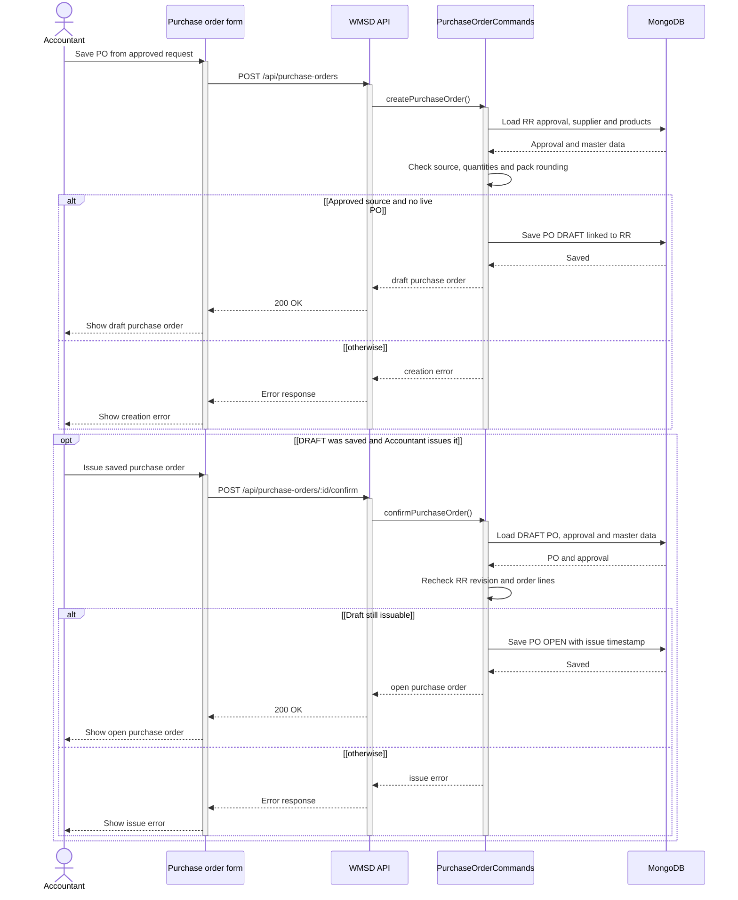
```mermaid
sequenceDiagram
  actor X as Accountant
  participant U as Purchase order form
  participant A as WMSD API
  participant S as PurchaseOrderCommands
  participant D as MongoDB
  X->>U: Save PO from approved request
  activate U
  U->>A: POST /api/purchase-orders
  activate A
  A->>S: createPurchaseOrder()
  activate S
  S->>D: Load RR approval, supplier and products
  D-->>S: Approval and master data
  S->>S: Check source, quantities and pack rounding
  alt [Approved source and no live PO]
    S->>D: Save PO DRAFT linked to RR
    D-->>S: Saved
    S-->>A: draft purchase order
    A-->>U: 200 OK
    U-->>X: Show draft purchase order
  else [otherwise]
    S-->>A: creation error
    A-->>U: Error response
    U-->>X: Show creation error
  end
  deactivate S
  deactivate A
  deactivate U
  opt [DRAFT was saved and Accountant issues it]
    X->>U: Issue saved purchase order
    activate U
    U->>A: POST /api/purchase-orders/:id/confirm
    activate A
    A->>S: confirmPurchaseOrder()
    activate S
    S->>D: Load DRAFT PO, approval and master data
    D-->>S: PO and approval
    S->>S: Recheck RR revision and order lines
    alt [Draft still issuable]
      S->>D: Save PO OPEN with issue timestamp
      D-->>S: Saved
      S-->>A: open purchase order
      A-->>U: 200 OK
      U-->>X: Show open purchase order
    else [otherwise]
      S-->>A: issue error
      A-->>U: Error response
      U-->>X: Show issue error
    end
    deactivate S
    deactivate A
    deactivate U
  end
```

###### 1.2.2.2 Update Purchase Order (UC-10)

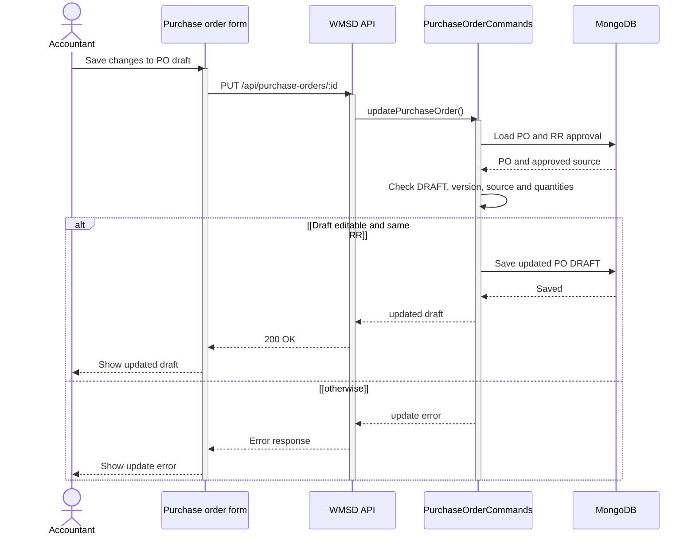
```mermaid
sequenceDiagram
  actor X as Accountant
  participant U as Purchase order form
  participant A as WMSD API
  participant S as PurchaseOrderCommands
  participant D as MongoDB
  X->>U: Save changes to PO draft
  activate U
  U->>A: PUT /api/purchase-orders/:id
  activate A
  A->>S: updatePurchaseOrder()
  activate S
  S->>D: Load PO and RR approval
  D-->>S: PO and approved source
  S->>S: Check DRAFT, version, source and quantities
  alt [Draft editable and same RR]
    S->>D: Save updated PO DRAFT
    D-->>S: Saved
    S-->>A: updated draft
    A-->>U: 200 OK
    U-->>X: Show updated draft
  else [otherwise]
    S-->>A: update error
    A-->>U: Error response
    U-->>X: Show update error
  end
  deactivate S
  deactivate A
  deactivate U
```

###### 1.2.2.3 Reschedule Purchase Order Expected Date (UC-11)

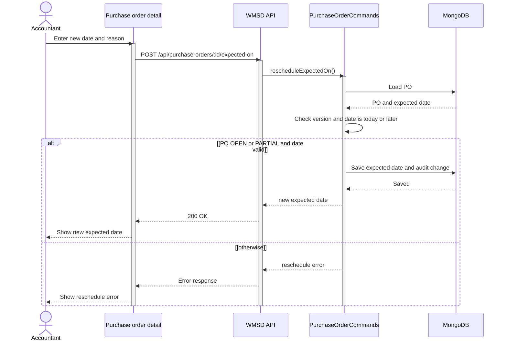
```mermaid
sequenceDiagram
  actor X as Accountant
  participant U as Purchase order detail
  participant A as WMSD API
  participant S as PurchaseOrderCommands
  participant D as MongoDB
  X->>U: Enter new date and reason
  activate U
  U->>A: POST /api/purchase-orders/:id/expected-on
  activate A
  A->>S: rescheduleExpectedOn()
  activate S
  S->>D: Load PO
  D-->>S: PO and expected date
  S->>S: Check version and date is today or later
  alt [PO OPEN or PARTIAL and date valid]
    S->>D: Save expected date and audit change
    D-->>S: Saved
    S-->>A: new expected date
    A-->>U: 200 OK
    U-->>X: Show new expected date
  else [otherwise]
    S-->>A: reschedule error
    A-->>U: Error response
    U-->>X: Show reschedule error
  end
  deactivate S
  deactivate A
  deactivate U
```

###### 1.2.2.4 Close Purchase Order Remainder (UC-12)

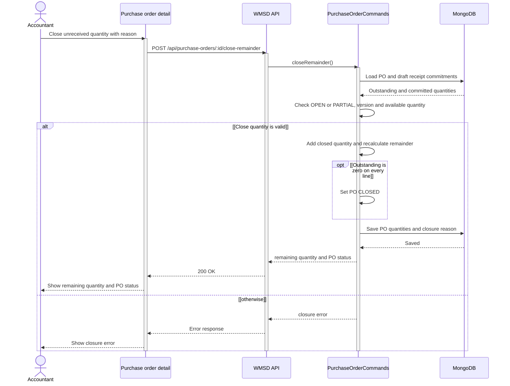
```mermaid
sequenceDiagram
  actor X as Accountant
  participant U as Purchase order detail
  participant A as WMSD API
  participant S as PurchaseOrderCommands
  participant D as MongoDB
  X->>U: Close unreceived quantity with reason
  activate U
  U->>A: POST /api/purchase-orders/:id/close-remainder
  activate A
  A->>S: closeRemainder()
  activate S
  S->>D: Load PO and draft receipt commitments
  D-->>S: Outstanding and committed quantities
  S->>S: Check OPEN or PARTIAL, version and available quantity
  alt [Close quantity is valid]
    S->>S: Add closed quantity and recalculate remainder
    opt [Outstanding is zero on every line]
      S->>S: Set PO CLOSED
    end
    S->>D: Save PO quantities and closure reason
    D-->>S: Saved
    S-->>A: remaining quantity and PO status
    A-->>U: 200 OK
    U-->>X: Show remaining quantity and PO status
  else [otherwise]
    S-->>A: closure error
    A-->>U: Error response
    U-->>X: Show closure error
  end
  deactivate S
  deactivate A
  deactivate U
```

###### 1.2.2.5 Reopen Purchase Order (UC-13)

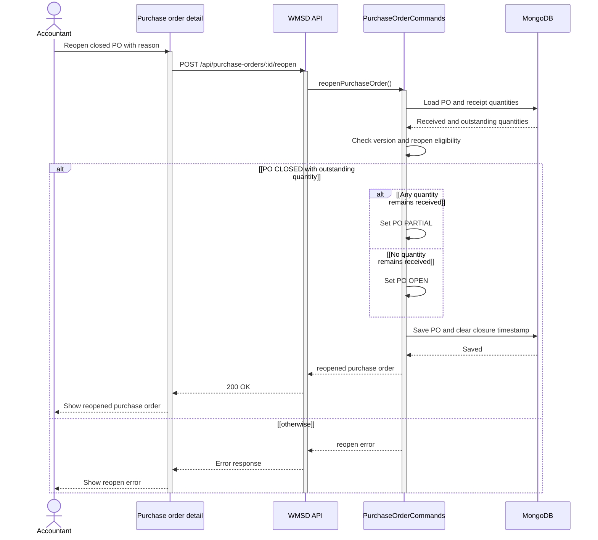
```mermaid
sequenceDiagram
  actor X as Accountant
  participant U as Purchase order detail
  participant A as WMSD API
  participant S as PurchaseOrderCommands
  participant D as MongoDB
  X->>U: Reopen closed PO with reason
  activate U
  U->>A: POST /api/purchase-orders/:id/reopen
  activate A
  A->>S: reopenPurchaseOrder()
  activate S
  S->>D: Load PO and receipt quantities
  D-->>S: Received and outstanding quantities
  S->>S: Check version and reopen eligibility
  alt [PO CLOSED with outstanding quantity]
    alt [Any quantity remains received]
      S->>S: Set PO PARTIAL
    else [No quantity remains received]
      S->>S: Set PO OPEN
    end
    S->>D: Save PO and clear closure timestamp
    D-->>S: Saved
    S-->>A: reopened purchase order
    A-->>U: 200 OK
    U-->>X: Show reopened purchase order
  else [otherwise]
    S-->>A: reopen error
    A-->>U: Error response
    U-->>X: Show reopen error
  end
  deactivate S
  deactivate A
  deactivate U
```

###### 1.2.2.6 Cancel Purchase Order (UC-14)

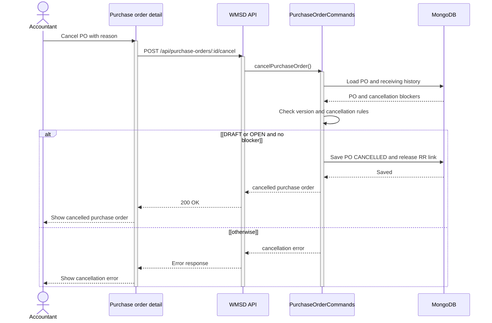
```mermaid
sequenceDiagram
  actor X as Accountant
  participant U as Purchase order detail
  participant A as WMSD API
  participant S as PurchaseOrderCommands
  participant D as MongoDB
  X->>U: Cancel PO with reason
  activate U
  U->>A: POST /api/purchase-orders/:id/cancel
  activate A
  A->>S: cancelPurchaseOrder()
  activate S
  S->>D: Load PO and receiving history
  D-->>S: PO and cancellation blockers
  S->>S: Check version and cancellation rules
  alt [DRAFT or OPEN and no blocker]
    S->>D: Save PO CANCELLED and release RR link
    D-->>S: Saved
    S-->>A: cancelled purchase order
    A-->>U: 200 OK
    U-->>X: Show cancelled purchase order
  else [otherwise]
    S-->>A: cancellation error
    A-->>U: Error response
    U-->>X: Show cancellation error
  end
  deactivate S
  deactivate A
  deactivate U
```

#### 1.3 Goods Inspection (ARR + INS)

##### 1.3.1 Class Diagram

Routers in `po-receiving.routes.js` authenticate and validate payloads with Zod, then dispatch directly to read/write services where RBAC permissions are enforced.

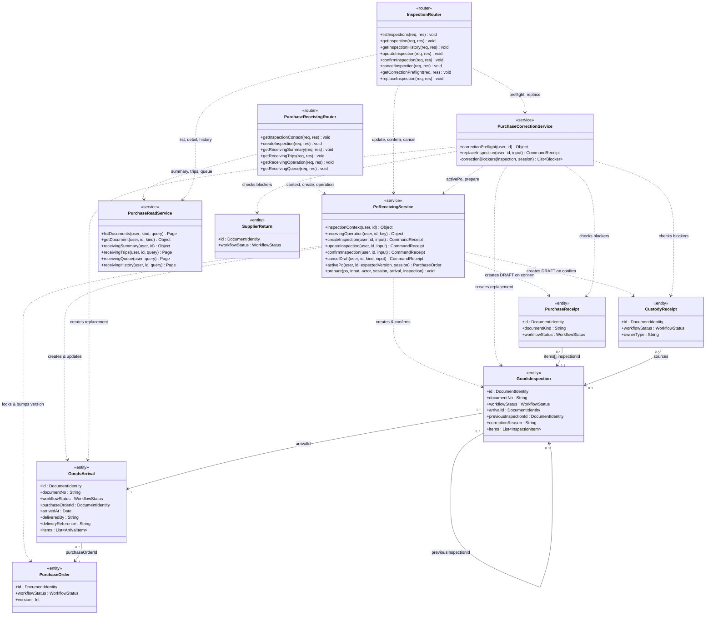
```mermaid
classDiagram
  class PurchaseReceivingRouter {
    <<router>>
    +getInspectionContext(req, res) void
    +createInspection(req, res) void
    +getReceivingSummary(req, res) void
    +getReceivingTrips(req, res) void
    +getReceivingOperation(req, res) void
    +getReceivingQueue(req, res) void
  }
  class InspectionRouter {
    <<router>>
    +listInspections(req, res) void
    +getInspection(req, res) void
    +getInspectionHistory(req, res) void
    +updateInspection(req, res) void
    +confirmInspection(req, res) void
    +cancelInspection(req, res) void
    +getCorrectionPreflight(req, res) void
    +replaceInspection(req, res) void
  }
  class PoReceivingService {
    <<service>>
    +inspectionContext(user, id) Object
    +receivingOperation(user, id, key) Object
    +createInspection(user, id, input) CommandReceipt
    +updateInspection(user, id, input) CommandReceipt
    +confirmInspection(user, id, input) CommandReceipt
    +cancelDraft(user, id, kind, input) CommandReceipt
    +activePo(user, id, expectedVersion, session) PurchaseOrder
    +prepare(po, input, actor, session, arrival, inspection) void
  }
  class PurchaseReadService {
    <<service>>
    +listDocuments(user, kind, query) Page
    +getDocument(user, id, kind) Object
    +receivingSummary(user, id) Object
    +receivingTrips(user, id, query) Page
    +receivingQueue(user, query) Page
    +receivingHistory(user, id, query) Page
  }
  class PurchaseCorrectionService {
    <<service>>
    +correctionPreflight(user, id) Object
    +replaceInspection(user, id, input) CommandReceipt
    -correctionBlockers(inspection, session) List~Blocker~
  }
  class PurchaseOrder {
    <<entity>>
    +id : DocumentIdentity
    +workflowStatus : WorkflowStatus
    +version : Int
  }
  class GoodsArrival {
    <<entity>>
    +id : DocumentIdentity
    +documentNo : String
    +workflowStatus : WorkflowStatus
    +purchaseOrderId : DocumentIdentity
    +arrivedAt : Date
    +deliveredBy : String
    +deliveryReference : String
    +items : List~ArrivalItem~
  }
  class GoodsInspection {
    <<entity>>
    +id : DocumentIdentity
    +documentNo : String
    +workflowStatus : WorkflowStatus
    +arrivalId : DocumentIdentity
    +previousInspectionId : DocumentIdentity
    +correctionReason : String
    +items : List~InspectionItem~
  }
  class PurchaseReceipt {
    <<entity>>
    +id : DocumentIdentity
    +documentKind : String
    +workflowStatus : WorkflowStatus
  }
  class CustodyReceipt {
    <<entity>>
    +id : DocumentIdentity
    +workflowStatus : WorkflowStatus
    +ownerType : String
  }
  class SupplierReturn {
    <<entity>>
    +id : DocumentIdentity
    +workflowStatus : WorkflowStatus
  }
  PurchaseReceivingRouter ..> PoReceivingService : context, create, operation
  PurchaseReceivingRouter ..> PurchaseReadService : summary, trips, queue
  InspectionRouter ..> PoReceivingService : update, confirm, cancel
  InspectionRouter ..> PurchaseReadService : list, detail, history
  InspectionRouter ..> PurchaseCorrectionService : preflight, replace
  PurchaseCorrectionService ..> PoReceivingService : activePo, prepare
  PoReceivingService ..> PurchaseOrder : locks & bumps version
  PoReceivingService ..> GoodsArrival : creates & updates
  PoReceivingService ..> GoodsInspection : creates & confirms
  PoReceivingService ..> PurchaseReceipt : creates DRAFT on confirm
  PoReceivingService ..> CustodyReceipt : creates DRAFT on confirm
  PurchaseCorrectionService ..> GoodsArrival : creates replacement
  PurchaseCorrectionService ..> GoodsInspection : creates replacement
  PurchaseCorrectionService ..> PurchaseReceipt : checks blockers
  PurchaseCorrectionService ..> CustodyReceipt : checks blockers
  PurchaseCorrectionService ..> SupplierReturn : checks blockers
  GoodsArrival "0..*" --> "1" PurchaseOrder : purchaseOrderId
  GoodsInspection "1..*" --> "1" GoodsArrival : arrivalId
  GoodsInspection "0..*" --> "0..1" GoodsInspection : previousInspectionId
  PurchaseReceipt "0..*" --> "0..1" GoodsInspection : items[].inspectionId
  CustodyReceipt "0..*" --> "0..1" GoodsInspection : sources
```

##### 1.3.2 Sequence diagrams

Confirming an inspection creates eligible receipt drafts. Stock is recorded when the receipts are posted.

###### 1.3.2.1 Create Goods Inspection (UC-37)

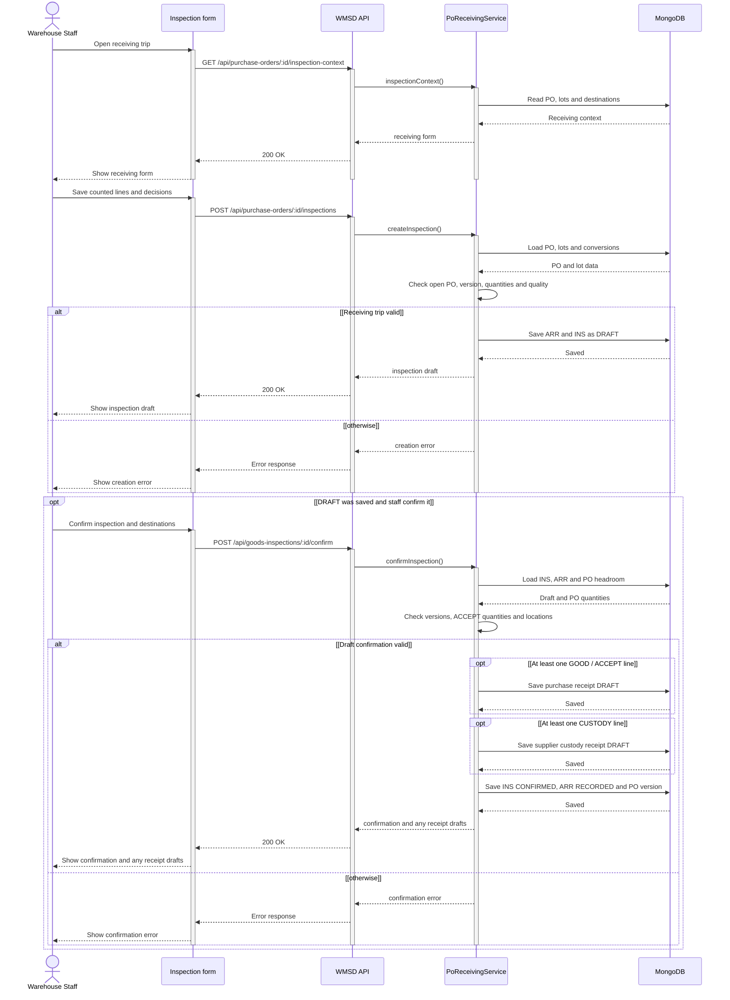
```mermaid
sequenceDiagram
  actor X as Warehouse Staff
  participant U as Inspection form
  participant A as WMSD API
  participant S as PoReceivingService
  participant D as MongoDB
  X->>U: Open receiving trip
  activate U
  U->>A: GET /api/purchase-orders/:id/inspection-context
  activate A
  A->>S: inspectionContext()
  activate S
  S->>D: Read PO, lots and destinations
  D-->>S: Receiving context
  S-->>A: receiving form
  A-->>U: 200 OK
  U-->>X: Show receiving form
  deactivate S
  deactivate A
  deactivate U
  X->>U: Save counted lines and decisions
  activate U
  U->>A: POST /api/purchase-orders/:id/inspections
  activate A
  A->>S: createInspection()
  activate S
  S->>D: Load PO, lots and conversions
  D-->>S: PO and lot data
  S->>S: Check open PO, version, quantities and quality
  alt [Receiving trip valid]
    S->>D: Save ARR and INS as DRAFT
    D-->>S: Saved
    S-->>A: inspection draft
    A-->>U: 200 OK
    U-->>X: Show inspection draft
  else [otherwise]
    S-->>A: creation error
    A-->>U: Error response
    U-->>X: Show creation error
  end
  deactivate S
  deactivate A
  deactivate U
  opt [DRAFT was saved and staff confirm it]
    X->>U: Confirm inspection and destinations
    activate U
    U->>A: POST /api/goods-inspections/:id/confirm
    activate A
    A->>S: confirmInspection()
    activate S
    S->>D: Load INS, ARR and PO headroom
    D-->>S: Draft and PO quantities
    S->>S: Check versions, ACCEPT quantities and locations
    alt [Draft confirmation valid]
      opt [At least one GOOD / ACCEPT line]
        S->>D: Save purchase receipt DRAFT
        D-->>S: Saved
      end
      opt [At least one CUSTODY line]
        S->>D: Save supplier custody receipt DRAFT
        D-->>S: Saved
      end
      S->>D: Save INS CONFIRMED, ARR RECORDED and PO version
      D-->>S: Saved
      S-->>A: confirmation and any receipt drafts
      A-->>U: 200 OK
      U-->>X: Show confirmation and any receipt drafts
    else [otherwise]
      S-->>A: confirmation error
      A-->>U: Error response
      U-->>X: Show confirmation error
    end
    deactivate S
    deactivate A
    deactivate U
  end
```

###### 1.3.2.2 Update Goods Inspection (UC-38)

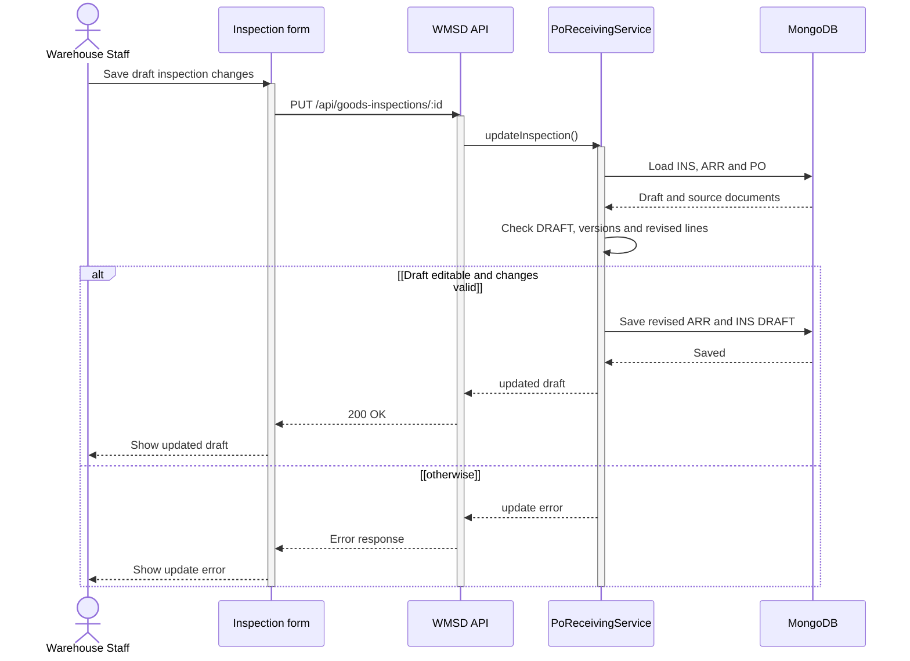
```mermaid
sequenceDiagram
  actor X as Warehouse Staff
  participant U as Inspection form
  participant A as WMSD API
  participant S as PoReceivingService
  participant D as MongoDB
  X->>U: Save draft inspection changes
  activate U
  U->>A: PUT /api/goods-inspections/:id
  activate A
  A->>S: updateInspection()
  activate S
  S->>D: Load INS, ARR and PO
  D-->>S: Draft and source documents
  S->>S: Check DRAFT, versions and revised lines
  alt [Draft editable and changes valid]
    S->>D: Save revised ARR and INS DRAFT
    D-->>S: Saved
    S-->>A: updated draft
    A-->>U: 200 OK
    U-->>X: Show updated draft
  else [otherwise]
    S-->>A: update error
    A-->>U: Error response
    U-->>X: Show update error
  end
  deactivate S
  deactivate A
  deactivate U
```

###### 1.3.2.3 Cancel Goods Inspection (UC-39)

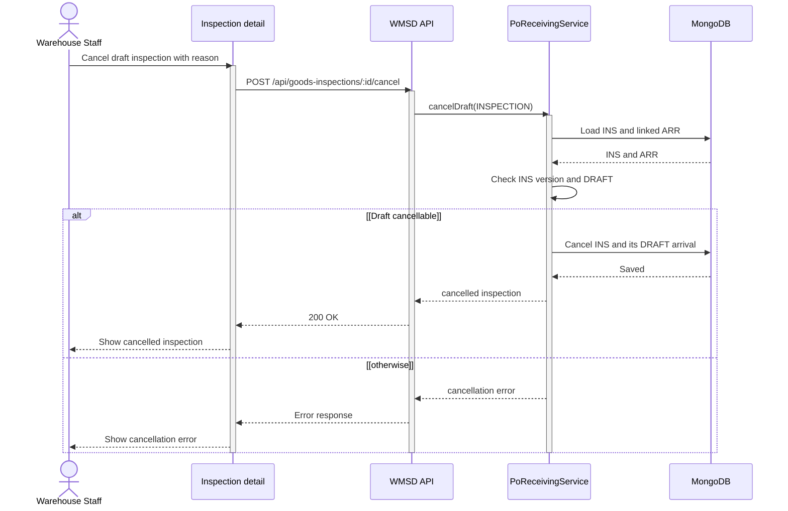
```mermaid
sequenceDiagram
  actor X as Warehouse Staff
  participant U as Inspection detail
  participant A as WMSD API
  participant S as PoReceivingService
  participant D as MongoDB
  X->>U: Cancel draft inspection with reason
  activate U
  U->>A: POST /api/goods-inspections/:id/cancel
  activate A
  A->>S: cancelDraft(INSPECTION)
  activate S
  S->>D: Load INS and linked ARR
  D-->>S: INS and ARR
  S->>S: Check INS version and DRAFT
  alt [Draft cancellable]
    S->>D: Cancel INS and its DRAFT arrival
    D-->>S: Saved
    S-->>A: cancelled inspection
    A-->>U: 200 OK
    U-->>X: Show cancelled inspection
  else [otherwise]
    S-->>A: cancellation error
    A-->>U: Error response
    U-->>X: Show cancellation error
  end
  deactivate S
  deactivate A
  deactivate U
```

###### 1.3.2.4 Correct Goods Inspection (UC-41)

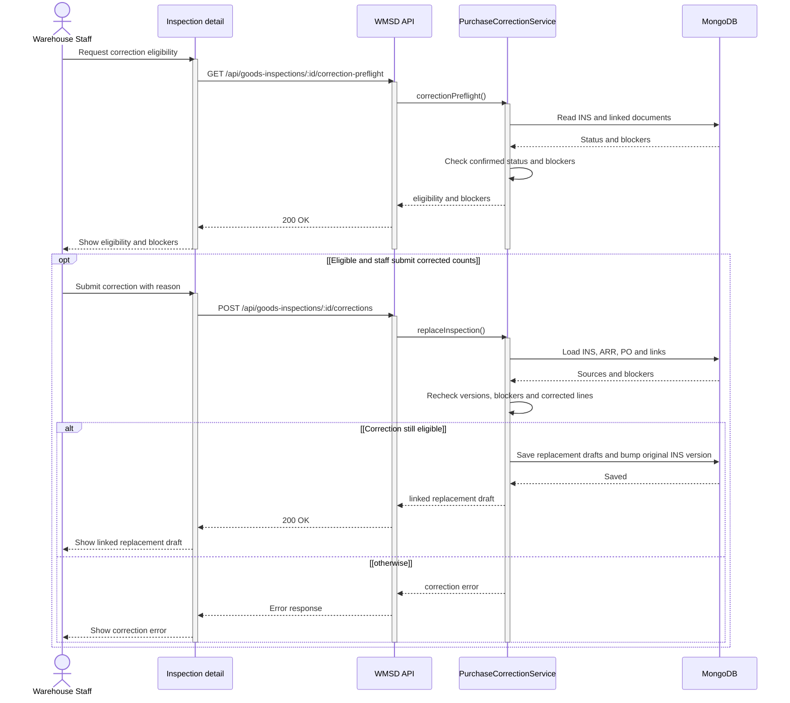
```mermaid
sequenceDiagram
  actor X as Warehouse Staff
  participant U as Inspection detail
  participant A as WMSD API
  participant S as PurchaseCorrectionService
  participant D as MongoDB
  X->>U: Request correction eligibility
  activate U
  U->>A: GET /api/goods-inspections/:id/correction-preflight
  activate A
  A->>S: correctionPreflight()
  activate S
  S->>D: Read INS and linked documents
  D-->>S: Status and blockers
  S->>S: Check confirmed status and blockers
  S-->>A: eligibility and blockers
  A-->>U: 200 OK
  U-->>X: Show eligibility and blockers
  deactivate S
  deactivate A
  deactivate U
  opt [Eligible and staff submit corrected counts]
    X->>U: Submit correction with reason
    activate U
    U->>A: POST /api/goods-inspections/:id/corrections
    activate A
    A->>S: replaceInspection()
    activate S
    S->>D: Load INS, ARR, PO and links
    D-->>S: Sources and blockers
    S->>S: Recheck versions, blockers and corrected lines
    alt [Correction still eligible]
      S->>D: Save replacement drafts and bump original INS version
      D-->>S: Saved
      S-->>A: linked replacement draft
      A-->>U: 200 OK
      U-->>X: Show linked replacement draft
    else [otherwise]
      S-->>A: correction error
      A-->>U: Error response
      U-->>X: Show correction error
    end
    deactivate S
    deactivate A
    deactivate U
  end
```

#### 1.4 Purchase Goods Receipt (GR)

##### 1.4.1 Class Diagram

`GoodsReceiptRouter` exposes unified `/goods-receipts` queries and mounts `PurchaseReceiptRouter` at `/purchase`. Custody endpoints (`/custody-receipts` and `/custody-releases`) cover both initial posting/reversal and custody resolution (`reinspectCustody`, `decideCustody`, `createCustodyResolution`, `postCustodyRelease`) via `PurchaseCustodyService`.

```mermaid
classDiagram
  class GoodsReceiptRouter {
    <<router>>
    +listUnifiedReceipts(req, res) void
    +getUnifiedReceipt(req, res) void
    +mountPurchaseRouter() void
  }
  class PurchaseReceiptRouter {
    <<router>>
    +listPurchaseReceipts(req, res) void
    +getPurchaseReceipt(req, res) void
    +postPurchaseReceipt(req, res) void
    +cancelDraftReceipt(req, res) void
    +changeDestinations(req, res) void
    +getReversalPreflight(req, res) void
    +reversePurchaseReceipt(req, res) void
  }
  class CustodyRouter {
    <<router>>
    +listCustodyReceipts(req, res) void
    +getCustodyReceipt(req, res) void
    +postCustodyReceipt(req, res) void
    +cancelDraftCustody(req, res) void
    +getCustodyReversalPreflight(req, res) void
    +reverseCustodyReceipt(req, res) void
    +reinspectCustody(req, res) void
    +decideCustody(req, res) void
    +createCustodyResolution(req, res) void
    +getCustodyRelease(req, res) void
    +postCustodyRelease(req, res) void
  }
  class PoReceivingService {
    <<service>>
    +postReceipt(user, id, input) CommandReceipt
    +postCustodyReceipt(user, id, input) CommandReceipt
    +cancelDraft(user, id, kind, input) CommandReceipt
    +changeDestinations(user, id, input) CommandReceipt
    -intakePortions(item, condition, portions, session) List
  }
  class PurchaseReadService {
    <<service>>
    +listDocuments(user, kind, query) Page
    +getDocument(user, id, kind) Object
  }
  class PurchaseCorrectionService {
    <<service>>
    +reversalPreflight(user, id, kind) Object
    +reverseReceipt(user, id, input, kind) CommandReceipt
    +eligible(receipt, actor, session) Object
  }
  class PurchaseCustodyService {
    <<service>>
    +reinspectCustody(user, id, input) CommandReceipt
    +decideCustody(user, id, input) CommandReceipt
    +createCustodyResolution(user, id, input, action) CommandReceipt
    +postOwnedCustody(receipt, item, po, posting, actor, session) void
    +postCustodyRelease(user, id, input) CommandReceipt
    +transferCustodyStock(sourceId, target, item, posting, actor, session, preferredIds) void
  }
  class StockUtils {
    <<utility>>
    +guardLocations(ids, session) void
    +locationAt(id, warehouseId, kinds, session) WarehouseLocation
    +balanceAt(pointFields, source, qualityStatus, session) InventoryBalance
    +beginStock(document, user, operation, input) StockTransaction
    +receiveStock(target, item, portions, posting, actor, session, condition) void
    +sourceContext(id, session) Object
    +splitPortions(portions, amount, actorId) Object
    +freeQuantity(balance, session) Decimal
    +verifyCapacity(locations, session) void
  }
  class PurchaseReceipt {
    <<entity>>
    +id : DocumentIdentity
    +documentNo : String
    +documentKind : String
    +workflowStatus : WorkflowStatus
    +purchaseOrderId : DocumentIdentity
    +arrivalId : DocumentIdentity
    +supplierId : ObjectId
    +receivedAt : Date
    +stockTransactionId : ObjectId
    +postedBy : ObjectId
    +postedAt : Date
    +items : List~PurchaseReceiptItem~
  }
  class CustodyReceipt {
    <<entity>>
    +id : DocumentIdentity
    +documentNo : String
    +workflowStatus : WorkflowStatus
    +ownerType : String
    +ownerId : ObjectId
    +stockTransactionId : ObjectId
    +items : List~CustodyReceiptItem~
  }
  class CustodyRelease {
    <<entity>>
    +id : DocumentIdentity
    +documentNo : String
    +workflowStatus : WorkflowStatus
    +custodyDecisionId : ObjectId
    +stockTransactionId : ObjectId
  }
  class InventoryBalance {
    <<entity>>
    +id : ObjectId
    +holdingPointId : ObjectId
    +batchId : ObjectId
    +qualityStatus : String
    +ownerType : String
    +ownerId : ObjectId
    +quantityBase : Decimal
    +packagingPortions : List~Portion~
  }
  class StockTransaction {
    <<entity>>
    +id : ObjectId
    +sourceType : String
    +sourceId : DocumentIdentity
    +operation : String
    +reversedTransactionId : ObjectId
    +movements : List~StockMovement~
  }
  class StockReversal {
    <<entity>>
    +id : DocumentIdentity
    +documentNo : String
    +workflowStatus : WorkflowStatus
    +originalTransactionId : ObjectId
    +stockTransactionId : ObjectId
    +sourceDocument : SourceReference
  }
  class PurchaseOrder {
    <<entity>>
    +id : DocumentIdentity
    +workflowStatus : WorkflowStatus
  }
  GoodsReceiptRouter ..> PurchaseReceiptRouter : mounts /purchase
  PurchaseReceiptRouter ..> PurchaseReadService : list & detail
  PurchaseReceiptRouter ..> PoReceivingService : post, cancel, destinations
  PurchaseReceiptRouter ..> PurchaseCorrectionService : preflight & reverse
  CustodyRouter ..> PurchaseReadService : list & detail
  CustodyRouter ..> PoReceivingService : post & cancel
  CustodyRouter ..> PurchaseCorrectionService : preflight & reverse
  CustodyRouter ..> PurchaseCustodyService : reinspect, decide, resolve, release
  PoReceivingService ..> PurchaseCustodyService : postOwnedCustody
  PoReceivingService ..> StockUtils : guards & posts stock
  PoReceivingService ..> PurchaseReceipt : posts & updates
  PoReceivingService ..> CustodyReceipt : posts & cancels
  PoReceivingService ..> PurchaseOrder : updates PARTIAL / COMPLETED / CLOSED
  PurchaseCorrectionService ..> StockUtils : checks free qty & capacity
  PurchaseCorrectionService ..> PurchaseCustodyService : transferCustodyStock
  PurchaseCorrectionService ..> PurchaseOrder : updates PARTIAL / OPEN
  PurchaseCorrectionService ..> StockReversal : creates POSTED
  PurchaseCorrectionService ..> StockTransaction : records REVERSAL
  PurchaseCustodyService ..> CustodyReceipt : updates
  PurchaseCustodyService ..> PurchaseReceipt : creates ACCEPT draft
  PurchaseCustodyService ..> CustodyRelease : creates & posts RETURN
  PurchaseCustodyService ..> StockUtils : guards & splits stock
  StockUtils ..> InventoryBalance : updates balances
  StockUtils ..> StockTransaction : records movements
  PurchaseReceipt "0..*" --> "1" PurchaseOrder : purchaseOrderId
  PurchaseReceipt "0..1" --> "0..1" StockTransaction : stockTransactionId
  CustodyReceipt "0..1" --> "0..1" StockTransaction : stockTransactionId
  CustodyRelease "0..1" --> "0..1" StockTransaction : stockTransactionId
  StockReversal "0..1" --> "1" StockTransaction : originalTransactionId
  StockReversal "0..1" --> "0..1" StockTransaction : stockTransactionId
  StockTransaction "0..*" --> "1..*" InventoryBalance : movements
```

##### 1.4.2 Sequence diagrams

Purchase receipts record store-owned stock. Supplier custody receipts record supplier-owned stock. After a purchase receipt is posted, the PO is PARTIAL while quantity remains outstanding. When nothing is outstanding, the PO is CLOSED if any remainder was cancelled and COMPLETED otherwise. See BF-03 for relocation and BF-08 for supplier returns.

###### 1.4.2.1 Change Purchase Receipt Destinations

```mermaid
sequenceDiagram
  actor X as Warehouse Staff
  participant U as Purchase receipt detail
  participant A as WMSD API
  participant S as PoReceivingService
  participant D as MongoDB
  X->>U: Save new receiving locations
  activate U
  U->>A: PATCH /api/goods-receipts/purchase/:id/destinations
  activate A
  A->>S: changeDestinations()
  activate S
  S->>D: Load draft receipt, source quality and locations
  D-->>S: Receipt and location data
  S->>S: Check version and location type for quality
  alt [Draft and destinations valid]
    S->>D: Save destination changes
    D-->>S: Saved
    S-->>A: updated destinations
    A-->>U: 200 OK
    U-->>X: Show updated destinations
  else [otherwise]
    S-->>A: destination error
    A-->>U: Error response
    U-->>X: Show destination error
  end
  deactivate S
  deactivate A
  deactivate U
```

###### 1.4.2.2 Cancel Purchase Receipt

```mermaid
sequenceDiagram
  actor X as Warehouse Staff
  participant U as Purchase receipt detail
  participant A as WMSD API
  participant S as PoReceivingService
  participant D as MongoDB
  X->>U: Cancel draft receipt with reason
  activate U
  U->>A: POST /api/goods-receipts/purchase/:id/cancel
  activate A
  A->>S: cancelDraft(GR_PURCHASE)
  activate S
  S->>D: Load purchase receipt and PO
  D-->>S: Receipt and PO versions
  S->>S: Check DRAFT and both versions
  alt [Draft cancellable]
    S->>D: Save receipt CANCELLED and bump PO version
    D-->>S: Saved
    S-->>A: cancelled receipt
    A-->>U: 200 OK
    U-->>X: Show cancelled receipt
  else [otherwise]
    S-->>A: cancellation error
    A-->>U: Error response
    U-->>X: Show cancellation error
  end
  deactivate S
  deactivate A
  deactivate U
```

###### 1.4.2.3 Post Purchase Receipt (UC-40)

```mermaid
sequenceDiagram
  actor X as Warehouse Staff
  participant U as Purchase receipt detail
  participant A as WMSD API
  participant S as PoReceivingService
  participant D as MongoDB
  X->>U: Post draft purchase receipt
  activate U
  U->>A: POST /api/goods-receipts/purchase/:id/post
  activate A
  A->>S: postReceipt()
  activate S
  S->>D: Load receipt, PO and line sources
  D-->>S: Versions, headroom and sources
  S->>S: Check versions, PO headroom, sources and locations
  alt [Posting checks pass]
    loop [For each receipt line]
      alt [Source is GOOD / ACCEPT inspection line]
        S->>S: Receive into store-owned stock
      else [Source is accepted supplier custody]
        S->>S: Move supplier-held stock to owned stock
      end
    end
    S->>S: Verify capacity and derive PO status
    S->>D: Save POSTED receipt, stock transaction and PO
    D-->>S: Saved
    S-->>A: posted receipt and transaction
    A-->>U: 200 OK
    U-->>X: Show posted receipt and transaction
  else [otherwise]
    S-->>A: posting error
    A-->>U: Error response
    U-->>X: Show posting error
  end
  deactivate S
  deactivate A
  deactivate U
```

###### 1.4.2.4 Reverse Purchase Receipt (UC-42)

```mermaid
sequenceDiagram
  actor X as Warehouse Staff
  participant U as Purchase receipt detail
  participant A as WMSD API
  participant S as PurchaseCorrectionService
  participant D as MongoDB
  X->>U: Check reversal eligibility
  activate U
  U->>A: GET /api/goods-receipts/purchase/:id/reversal-preflight
  activate A
  A->>S: reversalPreflight(GR_PURCHASE)
  activate S
  S->>D: Read receipt, dependencies and stock
  D-->>S: Original transaction and blockers
  S->>S: Check eligibility and available stock
  S-->>A: reversal eligibility
  A-->>U: 200 OK
  U-->>X: Show reversal eligibility
  deactivate S
  deactivate A
  deactivate U
  opt [Eligible and staff confirm reversal]
    X->>U: Confirm reversal with reason
    activate U
    U->>A: POST /api/goods-receipts/purchase/:id/reverse
    activate A
    A->>S: reverseReceipt(GR_PURCHASE)
    activate S
    S->>D: Load receipt, original movement and PO
    D-->>S: Stock and both versions
    S->>S: Recheck blockers, stock and versions
    alt [Reversal still eligible]
      S->>S: Undo owned stock movement
      opt [Receipt came from supplier custody]
        S->>S: Restore supplier-held stock
      end
      opt [PO is not CLOSED]
        S->>S: Recalculate PO as OPEN or PARTIAL
      end
      S->>D: Save reversal, REVERSED receipt and PO version
      D-->>S: Saved
      S-->>A: reversal and stock transaction
      A-->>U: 200 OK
      U-->>X: Show reversal and stock transaction
    else [otherwise]
      S-->>A: reversal error
      A-->>U: Error response
      U-->>X: Show reversal error
    end
    deactivate S
    deactivate A
    deactivate U
  end
```

###### 1.4.2.5 Cancel Custody Receipt

```mermaid
sequenceDiagram
  actor X as Warehouse Staff
  participant U as Custody receipt detail
  participant A as WMSD API
  participant S as PoReceivingService
  participant D as MongoDB
  X->>U: Cancel draft custody receipt
  activate U
  U->>A: POST /api/custody-receipts/:id/cancel
  activate A
  A->>S: cancelDraft(CUSTODY_RECEIPT)
  activate S
  S->>D: Load supplier custody receipt
  D-->>S: Receipt and version
  S->>S: Check DRAFT, supplier owner and version
  alt [Draft cancellable]
    S->>D: Save custody receipt CANCELLED
    D-->>S: Saved
    S-->>A: cancelled custody receipt
    A-->>U: 200 OK
    U-->>X: Show cancelled custody receipt
  else [otherwise]
    S-->>A: cancellation error
    A-->>U: Error response
    U-->>X: Show cancellation error
  end
  deactivate S
  deactivate A
  deactivate U
```

###### 1.4.2.6 Post Custody Receipt (UC-50)

```mermaid
sequenceDiagram
  actor X as Warehouse Staff
  participant U as Custody receipt detail
  participant A as WMSD API
  participant S as PoReceivingService
  participant D as MongoDB
  X->>U: Choose custody locations and post
  activate U
  U->>A: POST /api/custody-receipts/:id/post
  activate A
  A->>S: postCustodyReceipt()
  activate S
  S->>D: Load receipt, inspection lines and locations
  D-->>S: Receipt sources and destinations
  S->>S: Check DRAFT, version, source and locations
  alt [Posting checks pass]
    S->>S: Receive supplier-owned stock and verify capacity
    S->>D: Save custody stock transaction and POSTED receipt
    D-->>S: Saved
    S-->>A: posted custody receipt and transaction
    A-->>U: 200 OK
    U-->>X: Show posted custody receipt and transaction
  else [otherwise]
    S-->>A: posting error
    A-->>U: Error response
    U-->>X: Show posting error
  end
  deactivate S
  deactivate A
  deactivate U
```

###### 1.4.2.7 Reverse Custody Receipt

```mermaid
sequenceDiagram
  actor X as Warehouse Staff
  participant U as Custody receipt detail
  participant A as WMSD API
  participant S as PurchaseCorrectionService
  participant D as MongoDB
  X->>U: Check custody reversal eligibility
  activate U
  U->>A: GET /api/custody-receipts/:id/reversal-preflight
  activate A
  A->>S: reversalPreflight(CUSTODY_RECEIPT)
  activate S
  S->>D: Read custody receipt, dependencies and stock
  D-->>S: Original transaction and blockers
  S->>S: Check eligibility and free supplier stock
  S-->>A: reversal eligibility
  A-->>U: 200 OK
  U-->>X: Show reversal eligibility
  deactivate S
  deactivate A
  deactivate U
  opt [Eligible and staff confirm reversal]
    X->>U: Confirm reversal with reason
    activate U
    U->>A: POST /api/custody-receipts/:id/reverse
    activate A
    A->>S: reverseReceipt(CUSTODY_RECEIPT)
    activate S
    S->>D: Load custody receipt and original movement
    D-->>S: Receipt version and supplier-held stock
    S->>S: Recheck eligibility, location and free stock
    alt [Reversal still eligible]
      S->>S: Deduct originally received supplier stock
      S->>D: Save reversal and custody receipt REVERSED
      D-->>S: Saved
      S-->>A: reversal and stock transaction
      A-->>U: 200 OK
      U-->>X: Show reversal and stock transaction
    else [otherwise]
      S-->>A: reversal error
      A-->>U: Error response
      U-->>X: Show reversal error
    end
    deactivate S
    deactivate A
    deactivate U
  end
```

### 2. BF-02 Defect detection, isolation and disposition — Implemented

#### 2.1 Class Diagram

```mermaid
classDiagram
  class WorkflowRoutes {
    +POST /defects
    +POST /defects/:id/proposals
    +POST /defects/:id/decision
    +POST /defects/:id/execute
  }
  class NativeReturnService {
    +createDefect()
    +submitDefectProposal()
    +decideDefect()
    +executeDefect()
  }
  class DefectReport {
    header.sourceKind
    holds
    resolutionPlans
    dispositions
  }
  class StockScrapRecord
  class StockQualityChange
  class InventoryBalance
  class ApprovalHistory
  WorkflowRoutes --> NativeReturnService
  NativeReturnService --> DefectReport
  NativeReturnService --> ApprovalHistory
  NativeReturnService --> StockScrapRecord : destroy
  NativeReturnService --> StockQualityChange : regrade/release
  DefectReport --> InventoryBalance : hold
```

#### 2.2 Sequence — Detect, hold, decide and execute

```mermaid
sequenceDiagram
  autonumber
  actor W as Warehouse Staff
  actor O as Store Owner
  participant API as /api/defects
  participant S as NativeReturnService
  participant DB as MongoDB
  W->>API: POST / {warehouseId, balanceId, quantity, sourceKind, reason, evidence}
  S->>DB: lock location, check free qty (not reserved/held)
  S->>DB: DefectReport with active hold (balance total unchanged)
  alt sourceKind = STOCKTAKE
    Note over S: balance-neutral hold only, resolution goes through BF-05 closure
  end
  W->>API: POST /:id/proposals {lines[lineId, qtyBase, outcome, targetQuality?]}
  S->>DB: resolution plan (destroy / regrade / release)
  O->>API: POST /:id/decision {decision, lines}
  S->>DB: ApprovalHistory (Owner ≠ proposer), approved quantity bound to plan
  W->>API: POST /:id/execute {lines, evidence}
  alt destroy
    S->>DB: StockScrapRecord, balance −qty, StockTransaction
  else regrade / release
    S->>DB: StockQualityChange, quality moved, total unchanged
  end
  S->>DB: release consumed hold, supplier return continues in BF-08
```

### 3. BF-03 Same-warehouse relocation — Implemented

#### 3.1 Class Diagram

```mermaid
classDiagram
  class LocationMovementRoutes {
    +GET /options
    +POST /
    +PATCH /:id
    +POST /:id/confirm
    +POST /:id/cancel
  }
  class LocationMovementService {
    +locationMovementOptions()
    +createLocationMovement()
    +editLocationMovement()
    +confirmLocationMovement()
    +cancelLocationMovement()
  }
  class TransferOrder {
    header.taskKind = RELOCATE
    workflowStatus OPEN|CONFIRMED|CANCELLED
  }
  class InventoryBalance
  class StockReservation
  class StockTransaction
  LocationMovementRoutes --> LocationMovementService
  LocationMovementService --> TransferOrder
  LocationMovementService --> InventoryBalance : splitPortions / moveStock
  LocationMovementService --> StockReservation : move with stock
  LocationMovementService --> StockTransaction
```

#### 3.2 Sequence — Create and confirm relocation

```mermaid
sequenceDiagram
  autonumber
  actor W as Warehouse Staff
  participant FE as /location-moves/create
  participant API as /api/location-movements
  participant S as LocationMovementService
  participant DB as MongoDB
  W->>FE: Select warehouse, source location, rows or whole location
  FE->>API: GET /options?warehouseId=
  W->>FE: Whole cartons/pieces + one destination
  FE->>API: POST / {warehouseId, reason, lines[sourceBalanceId, sourceBalanceVersion, toLocationId, enteredUnit, enteredQty]}
  S->>DB: same warehouse, different active locations, verified lot, free qty after open tasks, no lock
  S->>DB: simulate packaging split (no carton opening)
  S->>DB: TransferOrder RELOCATE OPEN
  opt change before execution
    W->>API: PATCH /:id or POST /:id/cancel (creator only)
  end
  W->>API: POST /:id/confirm {lines[lineId, actualQtyBase]}
  alt actual ≠ planned or missing line
    S-->>FE: 400 (no partial confirmation)
  else all lines equal plan
    S->>DB: source −q, destination +q, reservations moved, capacity check
    S->>DB: one StockTransaction, TO CONFIRMED
  end
```

### 4. BF-04 Inter-warehouse transfer — Implemented

#### 4.1 Class Diagram

```mermaid
classDiagram
  class TransferWriteService {
    +createRequest()
    +updateRequest()
    +reviewRequest()
    +createDispatch()
    +cancelDraftDispatch()
    +createRequirement()
    +confirmTask()
    +receiveTransfer()
    +closeRequest()
    +closePartialRequest()
  }
  class TransferDifferences {
    +proposeDifference()
    +reviewDifference()
  }
  class WarehouseTransferRequest
  class TransferDispatch {
    handovers[]
  }
  class InternalTransferRequirement
  class TransferOrder {
    taskKind PICK|PUTAWAY
  }
  class GoodsReceipt {
    documentKind TRANSFER
  }
  class StockDiscrepancy
  class StockHoldingPoint {
    IN_TRANSIT per dispatch line
  }
  TransferWriteService --> WarehouseTransferRequest
  TransferWriteService --> TransferDispatch
  TransferWriteService --> InternalTransferRequirement
  TransferWriteService --> TransferOrder
  TransferWriteService --> GoodsReceipt
  TransferWriteService --> StockHoldingPoint
  TransferDifferences --> StockDiscrepancy
  TransferDifferences --> GoodsReceipt : approve against
```

#### 4.2 Sequence — Request, approval and draft dispatch

```mermaid
sequenceDiagram
  autonumber
  actor WS as Source Warehouse Staff
  actor O as Store Owner
  participant API as /api/warehouse-transfers
  participant S as TransferWriteService
  participant DB as MongoDB
  WS->>API: GET /options?warehouseId=
  WS->>API: POST / {sourceWarehouseId, destinationWarehouseId, reason, lines}
  S->>DB: TR PENDING_APPROVAL
  O->>API: POST /:id/review {decision}
  alt REVISE
    S->>DB: TR REVISION_REQUIRED
    WS->>API: PUT /:id (creator edits, resubmits)
  else REJECT
    S->>DB: TR REJECTED
  else APPROVE (Owner ≠ creator)
    S->>DB: ApprovalHistory, TR APPROVED (no reservation)
  end
  WS->>API: POST /:id/outbound-deliveries {lines[requestLineId, sourceBalanceId, stagingLocationId, qtyBase]}
  S->>DB: GOOD/STORE, verified lot, ≤ approved remainder
  S->>DB: TransferDispatch DRAFT + StockReservation on source
  opt cancel draft
    WS->>API: POST /dispatches/:id/cancel {reason}
    S->>DB: release reservation, cancel open ITR/TO, restore TR allowance
  end
```

#### 4.3 Sequence — Pick with handover, receipt, put-away and close

```mermaid
sequenceDiagram
  autonumber
  actor WS as Source Warehouse Staff
  actor WD as Destination Warehouse Staff
  participant API as /api/warehouse-transfers
  participant S as TransferWriteService
  participant DB as MongoDB
  WS->>API: POST /documents/:dispatchId/internal-requirements
  S->>DB: one ITR + one PICK TO (unique), reservation → task
  WS->>API: POST /tasks/:pickToId/confirm {recipientName, vehiclePlate?}
  S->>DB: source → staging → IN_TRANSIT point (atomic), handover, TD POSTED
  WD->>API: GET /dispatches?receivable=true
  WD->>API: POST /dispatches/:id/receipts {lines[dispatchLineId, locationId, qtyBase, qualityCode, damageReason?]}
  S->>DB: receiver ≠ dispatcher, qty ≤ transit
  S->>DB: GoodsReceipt TRANSFER: GOOD → RECEIVING, DAMAGED → QUARANTINE, transit −qty
  alt receipt has GOOD lines
    WD->>API: POST /documents/:receiptId/internal-requirements {destinations}
    S->>DB: one ITR + PUTAWAY TO
    WD->>API: POST /tasks/:putawayToId/confirm
    S->>DB: RECEIVING → STORAGE
  else all DAMAGED
    Note over S: no empty TO is created
  end
  WD->>API: POST /:id/close
  S->>DB: all approved dispatched, transit = 0, putaway done, no open difference → COMPLETED
  opt remaining approved qty will not be sent
    WD->>API: POST /:id/close-partial {reason}
  end
```

#### 4.4 Sequence — Transfer difference

```mermaid
sequenceDiagram
  autonumber
  actor WD as Destination Warehouse Staff
  actor O as Store Owner
  participant API as /api/warehouse-transfers
  participant D as TransferDifferences
  participant DB as MongoDB
  WD->>API: POST /dispatches/:id/differences {reason, lines[dispatchLineId, qtyBase]}
  D->>DB: qty ≤ transit, no duplicate open record → StockDiscrepancy (CLCK) OPEN
  O->>API: POST /differences/:id/review {decision, receiptId?}
  alt APPROVE (Owner ≠ reporter)
    D->>DB: receiptId = later POSTED receipt of the same dispatch with enough unused qty
    D->>DB: ApprovalHistory + resolutionEvents, record resolved
  else REJECT / REVISE
    D->>DB: decision history, record stays OPEN
  end
  Note over D: posted quantities are never edited, no automatic loss write-off
```

### 5. BF-05 Stocktake, reconciliation and adjustment — Closure implemented; planning/counting design target

#### 5.1 Class Diagram

```mermaid
classDiagram
  class StocktakeClosureService {
    +listStocktakes()
    +getStocktake()
    +approvalContent(plan)
    +closeStocktake()
  }
  class Stocktake {
    header.scope
    resolutionPlans[]
    workflowStatus
  }
  class StocktakeSnapshot
  class StocktakeCount
  class StocktakeLocationLock
  class StockAdjustment
  class ApprovalHistory
  class InventoryBalance
  StocktakeClosureService --> Stocktake
  StocktakeClosureService --> StocktakeSnapshot
  StocktakeClosureService --> StocktakeCount : latest selected
  StocktakeClosureService --> ApprovalHistory : plan approval
  StocktakeClosureService --> StockAdjustment : DELTA
  StocktakeClosureService --> InventoryBalance : RECLASS / RELOCATE
  StocktakeClosureService --> StocktakeLocationLock : unlock
```

#### 5.2 Sequence — Plan, freeze and count (design target)

```mermaid
sequenceDiagram
  autonumber
  actor O as Store Owner
  actor W as Warehouse Staff
  participant API as Stocktake API (planned)
  participant DB as MongoDB
  O->>API: Create session (scope, schedule, counters)
  W->>API: Activate session
  API->>DB: check open tasks / overlap, atomically lock locations + immutable snapshot
  W->>API: Export count sheet
  loop each location / lot
    W->>API: Record count attempt (carton/piece, quality, evidence)
    API->>DB: append StocktakeCount (blank ≠ zero)
  end
  W->>API: Reconcile, recount when evidence is insufficient
  W->>API: Propose resolution plan (DELTA / RECLASS / RELOCATE)
  O->>API: Approve plan (Owner ≠ proposer) → ApprovalHistory
  W->>API: Record execution evidence per line
  Note over API: Not yet exposed by the API, data is the input of 5.3
```

#### 5.3 Sequence — Close stocktake (implemented)

```mermaid
sequenceDiagram
  autonumber
  actor O as Store Owner
  participant API as /api/stocktakes
  participant S as StocktakeClosureService
  participant DB as MongoDB
  O->>API: POST /:id/close {planId?, expectedPlanVersion?, selectedCounts?, reason}
  S->>DB: stock_adjustment:post, warehouse scope, latest counts, balances still match snapshot
  alt no variance
    S->>DB: every snapshot has selected count (EMPTY_LOCATION = 0)
    S->>DB: close + unlock, no ADJ, no ledger of 0
  else variance with approved plan
    S->>DB: ApprovalHistory matches approvalContent(plan), approver ≠ proposer
    S->>DB: executionRecords complete, executor ≠ closer, evidence attached
    S->>DB: DELTA → StockAdjustment, RECLASS quality, RELOCATE location
    S->>DB: capacity + reservation checks, StockTransaction, unlock in same transaction
  end
  alt unresolved defect hold or mismatch
    S-->>API: reject, keep freeze
  end
```

### 6. BF-06 Sales order and direct warehouse issue

Report 3 BF-06 is the requirements authority. Sales owns SO entry and issue-linked customer receipt evidence; Warehouse owns direct issue posting and actual unreceived-goods intake. Buyer information is document-scoped. New records require no customer catalogue, WIR, OD or sales picking task.

#### 6.1 Direct issue relationships

```mermaid
classDiagram
  class SalesOrder
  class SalesGoodsIssue
  class InventoryBalance
  class IssueReceiptEvidence
  class GoodsReceipt
  SalesOrder "1" --> "many" SalesGoodsIssue : source order
  SalesGoodsIssue --> InventoryBalance : actual source stock
  SalesGoodsIssue "1" --> "many" IssueReceiptEvidence : embedded evidence
  SalesGoodsIssue "1" --> "many" GoodsReceipt : actual unreceived intake
```

#### 6.2 SO and direct warehouse issue

```mermaid
sequenceDiagram
  autonumber
  actor SA as Sales Staff
  actor W as Warehouse Staff
  participant API as Order and Goods Issue API
  participant DB as MongoDB
  SA->>API: Save verified source SO, document buyer details and lines
  API->>DB: Validate source identity and save SO without stock change
  W->>API: Create direct issue for SO and actual source stock
  API->>DB: Check order allowance and save DRAFT without stock change
  W->>API: Post actual issue with current version and operation key
  API->>DB: Recheck allowance, stock, scope, packaging, holds and freeze
  API->>DB: Deduct stock and commit issue, ledger, audit and idempotent result
  SA->>API: Record externally evidenced customer receipt on issue
  API->>DB: Check per-item shared caps and save evidence, no stock change
  opt Unreceived goods physically return
    W->>API: Record actual quantity, quality, destination, reason and evidence
    API->>DB: Post linked receipt once and restore actual stock/order allowance
  end
```

The current direct-issue runtime is described in [GOODS_ISSUES.md](../08_api/GOODS_ISSUES.md). Removing required customer-master input is a scope change that still needs API/model alignment; these diagrams do not prove that change is deployed.

### 7. BF-07 Customer returns

Customer returns remain active. Source eligibility uses issue-linked receipt evidence or verified external history and cumulative return claims. Inspection records facts without custody; only accepted receipt posts STORE stock. Separate failed-delivery requests/worklists are outside the selected design.

#### 7.1 Return relationships

```mermaid
classDiagram
  class CustomerReturn
  class SalesGoodsIssue
  class ExternalReference
  class ReturnQuantityClaim
  class GoodsReceipt
  CustomerReturn --> SalesGoodsIssue : evidenced received source
  CustomerReturn --> ExternalReference : verified history alternative
  CustomerReturn --> ReturnQuantityClaim : remaining source quantity
  CustomerReturn --> GoodsReceipt : accepted actual receipt
```

#### 7.2 Inspect, decide and receive

```mermaid
sequenceDiagram
  autonumber
  actor SA as Sales Staff
  actor W as Warehouse Staff
  actor O as Store Owner
  participant API as Customer Return API
  participant DB as MongoDB
  SA->>API: Request CR from evidenced issue or verified external source
  API->>DB: Validate remaining received quantity, save CR and source claim
  W->>API: Record actual quantity, condition, packaging and evidence
  API->>DB: Save inspection facts, no custody or stock posting
  alt Ordinary eligible case
    SA->>API: Accept or reject inspected quantities
  else Eligible substantiated exception
    O->>API: Decide current exception, distinct from proposer
  end
  W->>API: Receive current accepted quantities, quality and destination
  API->>DB: Post CUSTOMER_RETURN receipt and STORE stock once
  opt Rejected goods handed back
    W->>API: Record recipient, quantity and evidence
    API->>DB: Save handback event, no stock movement
  end
```

Buyer details come from the source document. Exact API/model input changes for removing customer-master dependence remain implementation work; historical references and posted ledgers remain intact.

### 8. BF-08 Supplier return — Implemented

#### 8.1 Class Diagram

```mermaid
classDiagram
  class NativeReturnService {
    +createSupplierReturn()
    +supplierAgreement()
    +dispatchSupplierReturn()
    +acknowledgeSupplierReturn()
    +closeSupplierReturn()
  }
  class SupplierReturn {
    items.details PROPOSED|VERIFIED
  }
  class SupplierReturnIssue
  class CustodyRelease {
    supplier acknowledgements
  }
  class StockReservation
  class DefectReport
  NativeReturnService --> SupplierReturn
  NativeReturnService --> SupplierReturnIssue : store-owned
  NativeReturnService --> CustodyRelease : supplier-owned
  NativeReturnService --> StockReservation
  SupplierReturn --> DefectReport : optional evidenced hold
```

#### 8.2 Sequence — Propose, agree, dispatch, acknowledge and close

```mermaid
sequenceDiagram
  autonumber
  actor W as Warehouse Staff
  actor A as Accountant
  participant API as /api/supplier-returns
  participant S as NativeReturnService
  participant DB as MongoDB
  W->>API: POST / {warehouseId, supplierId, lines[originLineId, balanceId, qtyBase, defectHoldId?]}
  S->>DB: source traces to a posted receipt / custody of this supplier, reserve qty → SR PROPOSED
  A->>API: POST /:id/agreement {reference, evidence, lines[lineId, qtyBase]}
  S->>DB: VERIFIED agreement per line (0 = refusal)
  W->>API: POST /:id/dispatch {recipientName, evidence, lines}
  alt store-owned stock
    S->>DB: SupplierReturnIssue, stock −qty once
  else supplier-owned custody
    S->>DB: CustodyRelease, custody −qty
  end
  A->>API: POST /:id/acknowledgement {lines[lineId, qtyBase, outcome ACCEPTED|REJECTED|DAMAGED]}
  A->>API: POST /:id/close {reason}
  S->>DB: all agreed dispatched + accepted ACK, release unused reservations (no stock posting, no Owner)
```

---

## III. Design for Non-Functional Requirements

### 1. Security Design

#### 1.1 Authentication Flow

WMSD uses JWT authentication. `POST /api/auth/login` checks the username (lower-cased) and the bcrypt hash; inactive or locked accounts are rejected. The response returns an access token and sets a refresh token cookie. The `authenticate` middleware reloads the user, role and permissions from MongoDB on every request, so locking an account or changing a role takes effect immediately.

```mermaid
sequenceDiagram
  autonumber
  actor U as User
  participant FE as SPA (apiClient)
  participant API as /api/auth
  participant DB as MongoDB
  U->>FE: username + password
  FE->>API: POST /login
  API->>DB: find user + role + permissions
  API->>API: bcrypt.compare, isActive
  API-->>FE: {accessToken, user profile+permissions} + Set-Cookie refresh_token (HttpOnly, SameSite=Strict)
  FE->>FE: store access token, build menu from permissions
  FE->>API: any /api call with Authorization: Bearer
  alt 401 expired
    FE->>API: POST /refresh (cookie)
    API-->>FE: new accessToken + profile
    FE->>API: retry original request
  end
  U->>FE: Logout
  FE->>API: POST /logout → clear cookies
```

**a. Token design**

| Aspect | Current design | Recommended before production |
|---|---|---|
| Token format | JWT signed with `JWT_SECRET` (jsonwebtoken default HS256) | Keep HS256 with a strong secret from the environment; remove the code fallback secrets. |
| Access token expiry | `JWT_EXPIRES_IN`, default 7 days | 15–30 minutes. |
| Access token storage | Browser `localStorage`, sent as Bearer | Memory-only storage to reduce XSS exposure. |
| Refresh token | JWT signed with `REFRESH_TOKEN_SECRET`, 7 days, cookie `refresh_token` HttpOnly, SameSite=Strict, Secure in production | Add rotation/revocation. |
| Login failure message | Same message for unknown user and wrong password | Keep (GB-04). Account lockout after repeated failures is not implemented. |

**b. CORS configuration**

| Environment | Allowed origins | Methods | Credentials |
|---|---|---|---|
| Development | Vite dev server proxies `/api` to the backend (`VITE_API_PROXY_TARGET`); `cors({origin:true})` reflects the request origin | GET, POST, PUT, PATCH, DELETE, OPTIONS | true |
| Production (recommended) | Explicit allowlist of the deployed FE origin instead of `origin:true` | Same | true |

**c. Email password recovery**

Report 3 specifies two password recovery requirements pending implementation. In UC-131, the account holder requests an OTP from Sign In. In UC-132, the Administrator requests an OTP from the target account's details. WMSD sends the code to the account's registered email address. The account holder verifies the code and chooses the new password on the Sign In screen. The Administrator sees the send outcome only.

The current Forgot Password dialog directs the user to support. The current account edit form still lets an authorized operator enter a new password via `PUT /api/users/:id`.

#### 1.2 Authorization & RBAC Implementation

| Aspect | Decision |
|---|---|
| Permission catalogue | 120 fixed codes `resource:action` in `seeds/data/permissions.data.js` (e.g. `purchase_order:create`, `stock_transfer:approve_variance`). Admin cannot invent codes. |
| Roles | Five default roles OWNER, ACCOUNTANT, WAREHOUSE, SALES, ADMIN plus Administrator-created custom roles that select existing permissions. One role per user; multiple `warehouseIds`. |
| Route check | `checkPermission('<code>')` per route → 403 `ERR-CORE-403-001`. |
| Service check | Inside the transaction `command()` reloads the actor and calls `requirePermission`; services check warehouse scope (403 `ERR-CORE-403-002`), record ownership, state and `expectedVersion`. Owner reads all warehouses. |
| Separation of duties | Approver ≠ requester (RR, TR, TR difference, PO closure, OTHER receipt, defect plan, CR exception, stocktake plan); transfer receiver ≠ dispatcher; stocktake executor ≠ closer. |
| Data redaction | Purchase prices only for Owner/Accountant; SO prices, source evidence and internal references hidden from Warehouse and custom roles; Sales sees only available quantity, not holds/custody. |
| FE | Menu and route guards use the session permission list (`routeAccess.ts`); the backend remains authoritative. |

Selected-scope role responsibilities (existing permission catalogue still includes compatibility codes; documentation alone does not revoke grants):

| Role | Key permissions |
|---|---|
| OWNER | `replenishment_request:approve`, `purchase_order:approve_exception`, `stock_transfer:approve`, `stock_transfer:approve_variance`, `defect:approve`, `customer_return:approve_exception`, `goods_receipt_other:approve`, `stocktake:create`, `stock_adjustment:approve/post`, `product:*`, `uom:*`, `warehouse_location:create/update` |
| ACCOUNTANT | `purchase_order:create/update`, `supplier:create/update`, `purchase_custody:decide`, `supplier_return:record_agreement/close`, `external_reference:*` |
| WAREHOUSE | receiving (`goods_receipt_inspection:*`, `putaway_task:*`), `stock_relocation:*`, `stock_transfer:create/update/dispatch/receive`, `goods_issue:*`, `defect:create/execute`, `customer_return:inspect/post`, `failed_delivery:post` (actual intake on issue only), `supplier_return:create/dispatch`, `stocktake:update/reconcile` |
| SALES | `replenishment_request:create/update`, `sales_order:*`, `delivery_confirmation:confirm` (issue-linked evidence), `customer_return:create/accept`, `payment_confirmation:confirm` |
| ADMIN | `user:*`, `access_control:*`, `warehouse_layout_function:update`; no business permissions |

#### 1.3 Data Protection

| Data category | At rest | In transit | Notes |
|---|---|---|---|
| Passwords | bcryptjs hash in `users.passwordHash` (`select:false`) | TLS in deployment | Never returned by the API. |
| Evidence files (SO source, inspection, returns) | Cloudinary authenticated assets; `attachments` keeps storage key, checksum, owner revision, access category | TLS | Download only through scoped endpoints issuing short-lived signed URLs; storage keys never in DTOs. Upload limited to real JPEG/PNG/PDF, 5 MB. |
| Prices | `purchase_orders.items[].unitPurchasePrice`, SO line prices | TLS | Redacted by role in DTOs, exports and audit views. |
| Secrets (JWT, Cloudinary, MongoDB URI) | Environment variables (`.env`, not committed) | — | Code fallback secrets must be removed for production. |

### 2. Performance & Scalability Design

#### 2.1 Caching Strategy

There is no server-side cache (no Redis). Consistency is preferred over caching because every stock read must reflect committed transactions.

| What is cached | Where | Invalidation |
|---|---|---|
| List/detail/options responses | RTK Query cache in the browser (`baseApi` tag types such as `NativeStock`) | Tags invalidated after each successful command; network/5xx retries keep the same idempotency key and payload. |
| Session profile and permissions | Browser storage | Replaced on login/refresh; server reloads permissions on every request. |

#### 2.2 Database Query Optimization

- Indexes declared on every model (see I.3): unique `documentNo`, `items._id`, `sources.documentId`, `{workflowStatus, createdAt}`, unique balance key `{holdingPointId, batchId, qualityStatus, ownerType, ownerId}`, unique partial index one PO per RR, one ITR per source and one TO per ITR.
- Automatic index creation is disabled at runtime (`_autoIndex:false`); indexes are created by the deployment scripts.
- Lists paginate server-side (`page`, `limit` ≤ 100), filter and apply warehouse scope before counting, and search by literal, case-insensitive document number.
- Reads that combine several collections run in a snapshot transaction; reports return `capturedAt`.
- Concurrency uses optimistic `version`, location operation guards and unique indexes instead of long locks; transactions retry on snapshot conflicts and document-number collisions.

---

## IV. Other Design Specifications

### 1. Document identity

New business documents use `_id = documentNo` = `[type]-[warehouse code or KD]-[YYMMDD]-[6-digit sequence]` in Asia/Ho_Chi_Minh time, e.g. `ĐMH-K-GACH-01-261113-000001`. Transfer-group documents shorten the warehouse code (`K-GACH-01` → `KG1`). The sequence is the highest existing number in the documents and `operation_records` for the same type/unit/day plus one, allocated inside the creating transaction; a duplicate-key collision retries the transaction. Selected-scope type codes (historical WIR/OD/FD numbering remains readable): YCBS (RR), ĐMH (PO), HĐK (arrival), PKN (inspection), PNM (purchase GR), PNK (other GR), LCV (relocation TO), YCĐC (TR), PXĐC (TD), YCNB (ITR), PNĐC (transfer receipt), CLCK (transfer difference), ĐBH (SO), PXB (GI-S), BCH (defect), ĐTK (CR), ĐTNCC (SR), KK (stocktake), ĐCKK (adjustment).

### 2. Inventory posting model

- A balance is keyed by holding point + lot + quality (PENDING/GOOD/DAMAGED/BLOCKED) + owner (STORE/SUPPLIER/CUSTOMER). Transit stock lives on an IN_TRANSIT holding point of the dispatch line.
- `packagingPortions[]` records sealed cartons and open/loose portions with measured volume; moves split only at whole-carton boundaries, so cartons are never opened implicitly.
- Every posting writes one `StockTransaction` with `movements[]` (from/to, before/after), the source document and an idempotency key; corrections append reversal transactions.
- Available quantity = GOOD/STORE in pickable STORAGE, verified lot, active product/warehouse/location, not frozen, minus reservations, uncovered open tasks and active defect holds.
- Capacity: locations have usable length/width and the warehouse clear height; postings check carton dimensions and total volume.

### 3. Units and conversions

`products.baseUnit` holds a UOM code. `conversions` keeps versioned factors per product and optional lot; a verified lot's carton factor equals `piecesPerCarton`. Area units (`uoms.areaMm2`, m² = 1,000,000) derive their factor from tile length × width and round quantities up to whole pieces. Document lines snapshot the factor (`baseUnitsPerUnit`) and keep `qtyBase` as the authoritative quantity.

### 4. Outbox and notifications

Each command writes a `system_events` row with status `PENDING` in the same transaction. A post-commit dispatcher (Report 3 JOB-01 and API-01 SMTP) is a design target: it should claim pending events, create per-recipient `notifications`, send email and record attempts without repeating any stock effect.

### 5. Warehouse 2D/3D layout

`warehouses.layout3d` stores a draft (outline, walls, doors, zones as rotated rectangles, slots, pallets, function catalogue per warehouse); `layout3dApplied` and `layout3dAppliedAt` store the applied snapshot. `PUT /api/warehouse-catalogue/:id/layout` saves drafts with `expectedUpdatedAt`; `apply:true` validates containment, slot overlap and height limits and writes audit atomically. Layout data never changes stock or location types.

### 6. Implementation status against Report 3

| Report 3 area | Status in code (14/11/2026) |
|---|---|
| BF-01 RR, PO, inspection, purchase GR and supplier custody (see §II.1) | Implemented. Purchase put-away routes were removed on 17/11/2026; RECEIVING → STORAGE uses BF-03 relocation. |
| BF-02 defects (UC-73–78) | Implemented. |
| BF-03 relocation (UC-47–50) | Implemented. |
| BF-04 transfer (UC-51–56, 120) | Implemented, including differences and partial close. |
| BF-05 stocktake (UC-93–105, 121) | List/detail and closure (UC-105) implemented; planning, activation, counting, plan proposal/approval and execution recording have no API yet. |
| BF-06 sales (UC-57-61, 69-72, 117-119, 129-130) | Selected design uses SO/direct issue with inline receipt evidence/intake. The current direct runtime contract records implemented behavior; removing customer-master input still needs API/model alignment. WIR/OD/sales picking requirements are retired. |
| BF-07 customer returns (UC-79-84, 86, 122-123) | Customer returns retained with fact-only inspection and accepted receipt. Standalone failed-delivery UCs 85/87 are retired; actual intake belongs to the source issue. Customer-master removal still needs contract alignment. |
| BF-08 supplier return (UC-88–92) | Implemented. |
| Master data, warehouses/locations/inventory/movement log (UC-17-32, 37-44, 114-116) | Retained. Customer catalogue UCs 33-36 are retired; existing customer records remain compatibility data pending explicit migration. |
| Accounts/roles (UC-106–112), reports (UC-113) | Implemented; account lockout after failed logins and SMTP notifications not implemented. |
